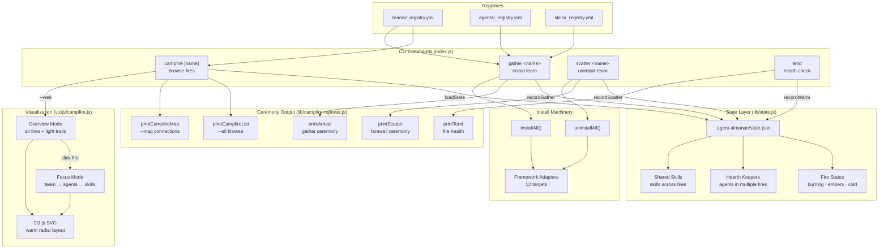
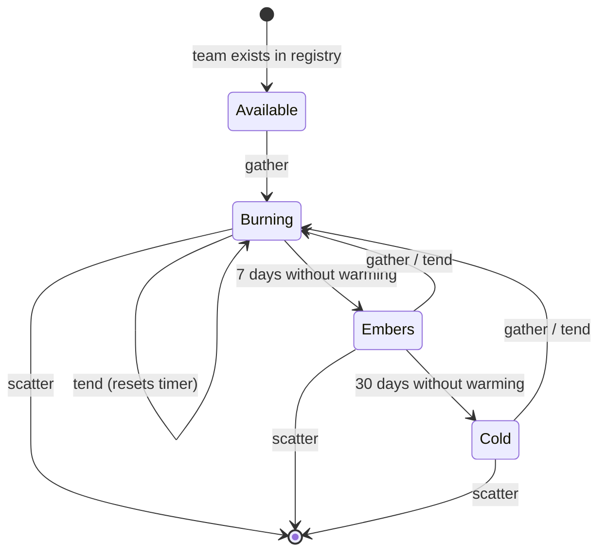

# CLI — Universal Installer

[](https://www.npmjs.com/package/agent-almanac)

Universal skill/agent/team installer for 12+ agentic CLI frameworks. Detects which AI tools are present in a project and installs content into the correct paths using pluggable adapters.

## Supported Frameworks

| Framework | Adapter | Install Path |
|-----------|---------|-------------|
| Claude Code | `claude-code.js` | `.claude/skills/`, `.claude/agents/` |
| Codex (OpenAI) | `codex.js` | `.agents/skills/` |
| Cursor | `cursor.js` | `.cursor/rules/` |
| Copilot | `copilot.js` | `.github/copilot-instructions/` |
| Gemini CLI | `gemini.js` | `.gemini/` |
| Aider | `aider.js` | `.aider/` |
| OpenCode | `opencode.js` | `.opencode/` |
| Windsurf | `windsurf.js` | `.windsurf/` |
| Vibe | `vibe.js` | `.vibe/` |
| Hermes | `hermes.js` | `.hermes/` |
| OpenClaw | `openclaw.js` | `.openclaw/` |
| Universal | `universal.js` | `.agents/skills/` |

## Usage

```bash
agent-almanac install <names...>     # Install skills by name
agent-almanac list                   # List available content
agent-almanac search <query>         # Search skills, agents, teams
agent-almanac detect                 # Show detected frameworks
agent-almanac audit                  # Health check installed content
agent-almanac uninstall <names...>   # Remove installed content
```

## Install

```bash
npm install -g agent-almanac
```

This registers two commands: `agent-almanac` and `almanac` (shorthand). Verify with:

```bash
agent-almanac --version   # 1.1.0
```

Requires Node.js 18+.

### From source

If you prefer to install from source:

```bash
git clone https://github.com/pjt222/agent-almanac.git
cd agent-almanac
npm install
npm link
```

### Try the Campfire

```bash
# Browse all 15 campfires (teams as circles of practice)
agent-almanac campfire --all

# Inspect a specific fire — see its keepers, pattern, and practices
agent-almanac campfire tending

# See which agents bridge multiple fires (hearth-keepers)
agent-almanac campfire --map

# Gather (install) a team — agents arrive, skills settle
agent-almanac gather tending

# Same, but with full skill-by-skill ceremony output
agent-almanac gather r-package-review --ceremonial

# Check fire health (burning / embers / cold)
agent-almanac tend

# Check without warming (read-only, does not update timestamps)
agent-almanac tend --dry-run

# Scatter (uninstall) a team — agents depart, shared skills stay
agent-almanac scatter tending

# Machine-readable output for scripting
agent-almanac campfire --json
```

### State

Campfire state is stored in `.agent-almanac/state.json` in your current working directory. It tracks which fires are gathered, when they were last warmed, and which agents belong to each. This file is already in `.gitignore`.

### Running from Another Project

The CLI auto-detects the almanac root by following `.claude/skills/` symlinks. If running from a directory without symlinks, pass the path explicitly:

```bash
agent-almanac campfire --all --source /path/to/agent-almanac
```

## Campfire Architecture

The campfire layer wraps the install/uninstall machinery in a team-oriented metaphor: teams are "fires", agents are "keepers", skills are "practices". It spans CLI commands, persistent state, ceremony output, and a D3 visualization mode.



### Fire Lifecycle



### Vocabulary Mapping

| Campfire Term | System Concept |
|---------------|---------------|
| Fire / Campfire | Team (installed) |
| Fire Keeper | Team lead agent |
| Keeper | Agent (team member) |
| Practice / Spark | Skill |
| Hearth Keeper | Agent shared across fires |
| Gather | Install team + agents + skills |
| Scatter | Uninstall (respecting shared deps) |
| Tend | Health check + warm timestamp |
| Burning / Embers / Cold | Recency of last use |

## Architecture

```
cli/
  index.js             # CLI entry point (commander.js)
  lib/
    registry.js        # Registry loading and skill resolution
    resolver.js        # Almanac root and target directory resolution
    detector.js        # Framework auto-detection
    installer.js       # Install/uninstall/audit orchestrator
    manifest.js        # Installed content manifest management
    reporter.js        # Console output formatting
    campfire-reporter.js # Warm ceremony output
    state.js           # .agent-almanac/state.json management
    transformer.js     # Content transformation for target frameworks
  adapters/
    base.js            # Base adapter class
    claude-code.js     # Claude Code adapter (full support)
    codex.js           # Codex adapter
    cursor.js          # Cursor adapter
    ...                # 12 framework adapters total
  test/
    cli.test.js        # CLI integration tests
```

## See Also

- [Root README](../README.md) -- project overview
- [Symlink Architecture](../guides/symlink-architecture.md) -- how discovery works across tools
- [skills/README.md](../skills/README.md#consuming-skills-from-different-systems) -- per-tool integration details
