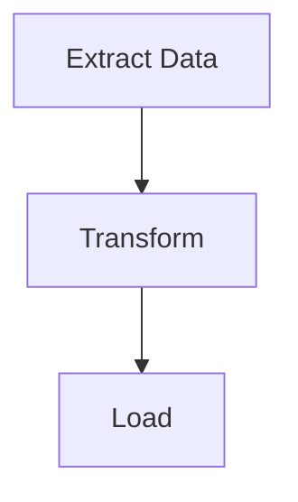

# Generate Workflow Diagram

Themed Mermaid flowchart from putior data → embed in docs.

## Use When

- After annotating sources → produce visual
- Regenerate after workflow changes
- Switch themes/formats for audiences
- Embed in README, Quarto, R Markdown

## In

- **Required**: workflow data from `put()`, `put_auto()`, or `put_merge()`
- **Optional**: theme (default `"light"`; light, dark, auto, minimal, github, viridis, magma, plasma, cividis)
- **Optional**: out target (console, file, clipboard, raw)
- **Optional**: interactive (`show_source_info`, `enable_clicks`)

## Do

### Step 1: Extract workflow data

```r
library(putior)

# From manual annotations
workflow <- put("./src/")

# From manual annotations, excluding specific files
workflow <- put("./src/", exclude = c("build-workflow\\.R$", "test_"))

# From auto-detection only
workflow <- put_auto("./src/")

# From merged (manual + auto)
workflow <- put_merge("./src/", merge_strategy = "supplement")
```

`node_type` → Mermaid shape:

| `node_type` | Mermaid Shape | Use Case |
|-------------|---------------|----------|
| `"input"` | Stadium `([...])` | Data sources, configuration files |
| `"output"` | Subroutine `[[...]]` | Generated artifacts, reports |
| `"process"` | Rectangle `[...]` | Processing steps (default) |
| `"decision"` | Diamond `{...}` | Conditional logic, branching |
| `"start"` / `"end"` | Stadium `([...])` | Entry/terminal nodes |

Each → CSS class (`class nodeId input;`) for theme styling.

→ DF w/ ≥1 row: `id`, `label` + optional `input`, `output`, `source_file`, `node_type`.

**If err:** empty → no annotations/patterns. Run `analyze-codebase-workflow` or check syntax: `put("./src/", validate = TRUE)`.

### Step 2: Select theme + options

```r
# List all available themes
get_diagram_themes()

# Standard themes
# "light"   — Default, bright colors
# "dark"    — For dark mode environments
# "auto"    — GitHub-adaptive with solid colors
# "minimal" — Grayscale, print-friendly
# "github"  — Optimized for GitHub README files

# Colorblind-safe themes (viridis family)
# "viridis" — Purple→Blue→Green→Yellow, general accessibility
# "magma"   — Purple→Red→Yellow, high contrast for print
# "plasma"  — Purple→Pink→Orange→Yellow, presentations
# "cividis" — Blue→Gray→Yellow, maximum accessibility (no red-green)
```

Extra params:
- `direction`: `"TD"` (top-down, default), `"LR"`, `"RL"`, `"BT"`
- `show_artifacts`: show artifact nodes (noisy for large, 16+ extra)
- `show_workflow_boundaries`: wrap source file nodes in subgraph
- `source_info_style`: source file display (subtitle)
- `node_labels`: label format

→ Theme names printed. Pick by context.

**If err:** unrecognized → falls back `"light"`. Check spelling.

### Step 3: Custom palette w/ `put_theme()` (opt)

```r
# Create custom palette — unspecified types inherit from base theme
cyberpunk <- put_theme(
  base = "dark",
  input    = c(fill = "#1a1a2e", stroke = "#00ff88", color = "#00ff88"),
  process  = c(fill = "#16213e", stroke = "#44ddff", color = "#44ddff"),
  output   = c(fill = "#0f3460", stroke = "#ff3366", color = "#ff3366"),
  decision = c(fill = "#1a1a2e", stroke = "#ffaa33", color = "#ffaa33")
)

# Use the palette parameter (overrides theme when provided)
mermaid_content <- put_diagram(workflow, palette = cyberpunk, output = "raw")
writeLines(mermaid_content, "workflow.mmd")
```

Accepts: `input`, `process`, `output`, `decision`, `artifact`, `start`, `end`. Each takes `c(fill = "#hex", stroke = "#hex", color = "#hex")`. Unset → base theme.

→ Mermaid out w/ custom classDef. Shapes preserved from `node_type`, colors change. All use `stroke-width:2px` (not overridable via `put_theme()`).

**If err:** not `putior_theme` class → descriptive err. Pass `put_theme()` return, not raw list.

**Fallback — manual classDef replacement** (fine-grained per-type stroke widths):

```r
mermaid_content <- put_diagram(workflow, theme = "dark", output = "raw")
lines <- strsplit(mermaid_content, "\n")[[1]]
lines <- lines[!grepl("^\\s*classDef ", lines)]
custom_defs <- c("  classDef input fill:#1a1a2e,stroke:#00ff88,stroke-width:3px,color:#00ff88")
mermaid_content <- paste(c(lines, custom_defs), collapse = "\n")
```

### Step 4: Generate Mermaid

```r
# Print to console (default)
cat(put_diagram(workflow, theme = "github"))

# Save to file
writeLines(put_diagram(workflow, theme = "github"), "docs/workflow.md")

# Get raw string for embedding
mermaid_code <- put_diagram(workflow, output = "raw", theme = "github")

# With source file info (shows which file each node comes from)
cat(put_diagram(workflow, theme = "github", show_source_info = TRUE))

# With clickable nodes (for VS Code, RStudio, or file:// protocol)
cat(put_diagram(workflow,
  theme = "github",
  enable_clicks = TRUE,
  click_protocol = "vscode"  # or "rstudio", "file"
))

# Full-featured
cat(put_diagram(workflow,
  theme = "viridis",
  show_source_info = TRUE,
  enable_clicks = TRUE,
  click_protocol = "vscode"
))
```

→ Valid Mermaid starting `flowchart TD` (or LR by direction). Nodes connected by arrows.

**If err:** `flowchart TD` no nodes → empty DF. Missing connections → check output filenames match input filenames across nodes.

### Step 5: Embed in doc

**GitHub README (```mermaid fence):**
````markdown
## Workflow


````

**Quarto (native mermaid chunk via knit_child):**
```r
# Chunk 1: Generate code (visible, foldable)
workflow <- put("./src/")
mermaid_code <- put_diagram(workflow, output = "raw", theme = "github")
```

```r
# Chunk 2: Output as native mermaid chunk (hidden)
#| output: asis
#| echo: false
mermaid_chunk <- paste0("```{mermaid}\n", mermaid_code, "\n```")
cat(knitr::knit_child(text = mermaid_chunk, quiet = TRUE))
```

**R Markdown (mermaid.js CDN or DiagrammeR):**
```r
DiagrammeR::mermaid(put_diagram(workflow, output = "raw"))
```

→ Renders in target format. GitHub native mermaid fence render.

**If err:** GitHub no render → fence must be exactly ` ```mermaid ` (no extra attrs). Quarto → use `knit_child()` (direct var interpolation in `{mermaid}` not supported).

## Check

- [ ] `put_diagram()` valid Mermaid (starts `flowchart`)
- [ ] All expected nodes appear
- [ ] Arrows between connected nodes
- [ ] Theme applied (check init block)
- [ ] Renders in target format

## Traps

- **Empty diagrams**: `put()` no rows → check annotations + syntax.
- **All nodes disconnected**: output filenames must exactly match input (inc ext). `data.csv` ≠ `Data.csv`.
- **Theme not visible on GitHub**: limited theme support. `"github"` designed for GitHub. `%%{init:...}%%` may be ignored.
- **Quarto var interpolation**: `{mermaid}` no R vars. Use `knit_child()`.
- **Clickable not working**: need renderer w/ Mermaid interaction. GitHub static no clicks. Use local Mermaid or putior Shiny sandbox.
- **Self-referential meta-pipeline**: scanning dir w/ build script → duplicate subgraph IDs + Mermaid errs. Use `exclude`:
  ```r
  workflow <- put("./src/", exclude = c("build-workflow\\.R$", "build-workflow\\.js$"))
  ```
- **`show_artifacts = TRUE` noisy**: large projects → 10-20+ artifact nodes. Use FALSE + rely on `node_type` for key in/out.

## →

- `annotate-source-files` — prereq before gen
- `analyze-codebase-workflow` — auto-detect supplements manual
- `setup-putior-ci` — automate regen in CI/CD
- `create-quarto-report` — embed in Quarto
- `build-pkgdown-site` — embed in pkgdown
