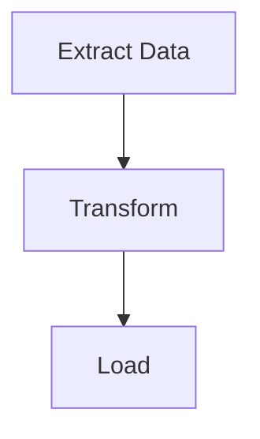

# Generate Workflow Diagram

Make themed Mermaid flowchart diagram from putior workflow data. Embed in docs.

## When Use

- After annotating source files, ready to make visual diagram
- Regenerate diagram after workflow changes
- Switch themes or output formats for different audiences
- Embed workflow diagrams in README, Quarto, R Markdown docs

## Inputs

- **Required**: Workflow data from `put()`, `put_auto()`, or `put_merge()`
- **Optional**: Theme name (default: `"light"`; options: light, dark, auto, minimal, github, viridis, magma, plasma, cividis)
- **Optional**: Output target: console, file path, clipboard, raw string
- **Optional**: Interactive features: `show_source_info`, `enable_clicks`

## Steps

### Step 1: Extract Workflow Data

Get workflow data from one of three sources.

```r
library(putior)

# From manual annotations
workflow <- put("./src/")

# From manual annotations, excluding specific files
workflow <- put("./src/", exclude = c("build-workflow\\.R$", "test_"))

# From auto-detection only
workflow <- put_auto("./src/")

# From merged (manual + auto)
workflow <- put_merge("./src/", merge_strategy = "supplement")
```

Workflow data frame may include `node_type` column from annotations. Node types control Mermaid shapes:

| `node_type` | Mermaid Shape | Use Case |
|-------------|---------------|----------|
| `"input"` | Stadium `([...])` | Data sources, configuration files |
| `"output"` | Subroutine `[[...]]` | Generated artifacts, reports |
| `"process"` | Rectangle `[...]` | Processing steps (default) |
| `"decision"` | Diamond `{...}` | Conditional logic, branching |
| `"start"` / `"end"` | Stadium `([...])` | Entry/terminal nodes |

Each `node_type` also gets CSS class (`class nodeId input;`) for theme-based styling.

**Got:** Data frame with at least one row, has `id`, `label`, optionally `input`, `output`, `source_file`, `node_type` columns.

**If fail:** Data frame empty? No annotations or patterns found. Run `analyze-codebase-workflow` first, or check annotations syntactically valid with `put("./src/", validate = TRUE)`.

### Step 2: Pick Theme + Options

Pick theme for target audience.

```r
# List all available themes
get_diagram_themes()

# Standard themes
# "light"   — Default, bright colors
# "dark"    — For dark mode environments
# "auto"    — GitHub-adaptive with solid colors
# "minimal" — Grayscale, print-friendly
# "github"  — Optimized for GitHub README files

# Colorblind-safe themes (viridis family)
# "viridis" — Purple→Blue→Green→Yellow, general accessibility
# "magma"   — Purple→Red→Yellow, high contrast for print
# "plasma"  — Purple→Pink→Orange→Yellow, presentations
# "cividis" — Blue→Gray→Yellow, maximum accessibility (no red-green)
```

Additional parameters:
- `direction`: Diagram flow direction — `"TD"` (top-down, default), `"LR"` (left-right), `"RL"`, `"BT"`
- `show_artifacts`: `TRUE`/`FALSE` — show artifact nodes (files, data); noisy for large workflows (16+ extra nodes)
- `show_workflow_boundaries`: `TRUE`/`FALSE` — wrap each source file nodes in Mermaid subgraph
- `source_info_style`: How source file info displayed on nodes (subtitle)
- `node_labels`: Format for node label text

**Got:** Theme names printed. Pick one by context.

**If fail:** Theme name not recognized? `put_diagram()` falls back to `"light"`. Check spelling.

### Step 3: Custom Palette with `put_theme()` (Optional)

9 built-in themes don't match project palette? Make custom theme with `put_theme()`.

```r
# Create custom palette — unspecified types inherit from base theme
cyberpunk <- put_theme(
  base = "dark",
  input    = c(fill = "#1a1a2e", stroke = "#00ff88", color = "#00ff88"),
  process  = c(fill = "#16213e", stroke = "#44ddff", color = "#44ddff"),
  output   = c(fill = "#0f3460", stroke = "#ff3366", color = "#ff3366"),
  decision = c(fill = "#1a1a2e", stroke = "#ffaa33", color = "#ffaa33")
)

# Use the palette parameter (overrides theme when provided)
mermaid_content <- put_diagram(workflow, palette = cyberpunk, output = "raw")
writeLines(mermaid_content, "workflow.mmd")
```

`put_theme()` takes `input`, `process`, `output`, `decision`, `artifact`, `start`, `end` node types. Each takes named vector `c(fill = "#hex", stroke = "#hex", color = "#hex")`. Unset types inherit from `base` theme.

**Got:** Mermaid output with custom classDef lines. Node shapes from `node_type` preserved; only colors change. All node types use `stroke-width:2px` — override not supported via `put_theme()`.

**If fail:** Palette object not `putior_theme` class? `put_diagram()` raises descriptive error. Pass return value of `put_theme()`, not raw list.

**Fallback — manual classDef replacement:** Fine-grained control beyond `put_theme()` (per-type stroke widths)? Generate with base theme + replace classDef lines manually:

```r
mermaid_content <- put_diagram(workflow, theme = "dark", output = "raw")
lines <- strsplit(mermaid_content, "\n")[[1]]
lines <- lines[!grepl("^\\s*classDef ", lines)]
custom_defs <- c("  classDef input fill:#1a1a2e,stroke:#00ff88,stroke-width:3px,color:#00ff88")
mermaid_content <- paste(c(lines, custom_defs), collapse = "\n")
```

### Step 4: Generate Mermaid Output

Make diagram in desired output mode.

```r
# Print to console (default)
cat(put_diagram(workflow, theme = "github"))

# Save to file
writeLines(put_diagram(workflow, theme = "github"), "docs/workflow.md")

# Get raw string for embedding
mermaid_code <- put_diagram(workflow, output = "raw", theme = "github")

# With source file info (shows which file each node comes from)
cat(put_diagram(workflow, theme = "github", show_source_info = TRUE))

# With clickable nodes (for VS Code, RStudio, or file:// protocol)
cat(put_diagram(workflow,
  theme = "github",
  enable_clicks = TRUE,
  click_protocol = "vscode"  # or "rstudio", "file"
))

# Full-featured
cat(put_diagram(workflow,
  theme = "viridis",
  show_source_info = TRUE,
  enable_clicks = TRUE,
  click_protocol = "vscode"
))
```

**Got:** Valid Mermaid code starts with `flowchart TD` (or `LR` by direction). Nodes connected by arrows showing data flow.

**If fail:** Output is `flowchart TD` with no nodes? Workflow data frame empty. Connections missing? Check output filenames match input filenames across nodes.

### Step 5: Embed in Target Document

Insert diagram into appropriate docs format.

**GitHub README (```mermaid code fence):**
````markdown
## Workflow


````

**Quarto document (native mermaid chunk via knit_child):**
```r
# Chunk 1: Generate code (visible, foldable)
workflow <- put("./src/")
mermaid_code <- put_diagram(workflow, output = "raw", theme = "github")
```

```r
# Chunk 2: Output as native mermaid chunk (hidden)
#| output: asis
#| echo: false
mermaid_chunk <- paste0("```{mermaid}\n", mermaid_code, "\n```")
cat(knitr::knit_child(text = mermaid_chunk, quiet = TRUE))
```

**R Markdown (with mermaid.js CDN or DiagrammeR):**
```r
DiagrammeR::mermaid(put_diagram(workflow, output = "raw"))
```

**Got:** Diagram renders correct in target format. GitHub renders mermaid code fences native.

**If fail:** GitHub won't render diagram? Code fence must use exactly ` ```mermaid ` (no extra attributes). Quarto → use `knit_child()` approach since direct variable interpolation in `{mermaid}` chunks not supported.

## Checks

- [ ] `put_diagram()` produces valid Mermaid code (starts with `flowchart`)
- [ ] All expected nodes appear in diagram
- [ ] Data flow connections (arrows) present between connected nodes
- [ ] Selected theme applied (check init block in output for theme-specific colors)
- [ ] Diagram renders correct in target format (GitHub, Quarto)

## Pitfalls

- **Empty diagrams**: Usually `put()` returned no rows. Check annotations exist + syntactically valid.
- **All nodes disconnected**: Output filenames must exactly match input filenames (including extension) for putior to draw connections. `data.csv` + `Data.csv` are different.
- **Theme not visible on GitHub**: GitHub mermaid renderer has limited theme support. `"github"` theme designed for GitHub. `%%{init:...}%%` theme block may be ignored by some renderers.
- **Quarto mermaid variable interpolation**: Quarto `{mermaid}` chunks don't support R variables direct. Use `knit_child()` from Step 5.
- **Clickable nodes not working**: Click directives need renderer supporting Mermaid interaction events. GitHub static renderer no click support. Use local Mermaid renderer or putior Shiny sandbox.
- **Self-referential meta-pipeline files**: Scanning directory including build script generating diagram → duplicate subgraph IDs + Mermaid errors. Use `exclude` parameter:
  ```r
  workflow <- put("./src/", exclude = c("build-workflow\\.R$", "build-workflow\\.js$"))
  ```
- **`show_artifacts = TRUE` too noisy**: Large projects generate many artifact nodes (10–20+), clutter diagram. Use `show_artifacts = FALSE` + rely on `node_type` annotations to mark key inputs/outputs explicit.

## See Also

- `annotate-source-files` — prerequisite: files annotated before diagram generation
- `analyze-codebase-workflow` — auto-detection supplements manual annotations
- `setup-putior-ci` — automate diagram regeneration in CI/CD
- `create-quarto-report` — embed diagrams in Quarto reports
- `build-pkgdown-site` — embed diagrams in pkgdown docs sites
