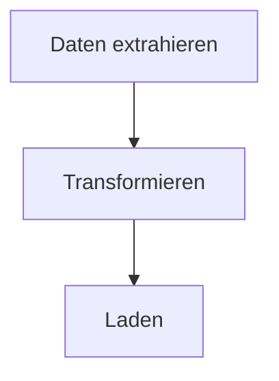

# Workflow-Diagramm generieren

Ein thematisiertes Mermaid-Flussdiagramm aus putior-Workflowdaten generieren und in Dokumentation einbetten.

## Wann verwenden

- Nach dem Annotieren von Quelldateien, wenn das visuelle Diagramm erstellt werden soll
- Neuerstellen eines Diagramms nach Workflow-Aenderungen
- Wechsel von Themen oder Ausgabeformaten fuer verschiedene Zielgruppen
- Einbettung von Workflow-Diagrammen in README-, Quarto- oder R-Markdown-Dokumente

## Eingaben

- **Erforderlich**: Workflowdaten von `put()`, `put_auto()` oder `put_merge()`
- **Optional**: Themenname (Standard: `"light"`; Optionen: light, dark, auto, minimal, github, viridis, magma, plasma, cividis)
- **Optional**: Ausgabeziel: Konsole, Dateipfad, Zwischenablage oder Rohtext
- **Optional**: Interaktive Funktionen: `show_source_info`, `enable_clicks`

## Vorgehensweise

### Schritt 1: Workflowdaten extrahieren

Workflowdaten aus einer von drei Quellen beziehen.

```r
library(putior)

# Aus manuellen Annotationen
workflow <- put("./src/")

# Aus manuellen Annotationen, bestimmte Dateien ausschliessend
workflow <- put("./src/", exclude = c("build-workflow\\.R$", "test_"))

# Nur aus Auto-Erkennung
workflow <- put_auto("./src/")

# Aus zusammengefuehrt (manuell + auto)
workflow <- put_merge("./src/", merge_strategy = "supplement")
```

Der Workflow-Dataframe kann eine `node_type`-Spalte aus Annotationen enthalten. Knotentypen steuern Mermaid-Formen:

| `node_type` | Mermaid-Form | Verwendungszweck |
|-------------|--------------|------------------|
| `"input"` | Stadion `([...])` | Datenquellen, Konfigurationsdateien |
| `"output"` | Unterprogramm `[[...]]` | Erzeugte Artefakte, Berichte |
| `"process"` | Rechteck `[...]` | Verarbeitungsschritte (Standard) |
| `"decision"` | Raute `{...}` | Bedingte Logik, Verzweigungen |
| `"start"` / `"end"` | Stadion `([...])` | Einstiegs-/Endknoten |

Jeder `node_type` erhaelt auch eine entsprechende CSS-Klasse (z.B. `class nodeId input;`) fuer themenbasiertes Styling.

**Erwartet:** Ein Dataframe mit mindestens einer Zeile, der `id`, `label` und optional `input`, `output`, `source_file`, `node_type`-Spalten enthaelt.

**Bei Fehler:** Wenn der Dataframe leer ist, wurden keine Annotationen oder Muster gefunden. Zuerst `analyze-codebase-workflow` ausfuehren, oder pruefen ob Annotationen syntaktisch gueltig sind mit `put("./src/", validate = TRUE)`.

### Schritt 2: Thema und Optionen waehlen

Ein fuer die Zielgruppe geeignetes Thema auswaehlen.

```r
# Alle verfuegbaren Themen auflisten
get_diagram_themes()

# Standardthemen
# "light"   — Standard, helle Farben
# "dark"    — Fuer Dunkelmodusumgebungen
# "auto"    — GitHub-adaptiv mit Volltonfarben
# "minimal" — Graustufen, druckfreundlich
# "github"  — Optimiert fuer GitHub-README-Dateien

# Farbenblindensichere Themen (Viridis-Familie)
# "viridis" — Lila→Blau→Gruen→Gelb, allgemeine Barrierefreiheit
# "magma"   — Lila→Rot→Gelb, hoher Kontrast fuer Druck
# "plasma"  — Lila→Pink→Orange→Gelb, Praesentationen
# "cividis" — Blau→Grau→Gelb, maximale Barrierefreiheit (kein Rot-Gruen)
```

Zusaetzliche Parameter:
- `direction`: Diagrammflussrichtung — `"TD"` (von oben nach unten, Standard), `"LR"` (von links nach rechts), `"RL"`, `"BT"`
- `show_artifacts`: `TRUE`/`FALSE` — Artefaktknoten anzeigen (Dateien, Daten); kann bei grossen Workflows unuebersichtlich werden (z.B. 16+ zusaetzliche Knoten)
- `show_workflow_boundaries`: `TRUE`/`FALSE` — Knoten jeder Quelldatei in einen Mermaid-Subgraphen einschliessen
- `source_info_style`: Wie Quelldateiinformationen auf Knoten angezeigt werden (z.B. als Untertitel)
- `node_labels`: Format fuer Knotenbeschriftungstext

**Erwartet:** Themennamen werden ausgegeben. Eines basierend auf dem Kontext auswaehlen.

**Bei Fehler:** Wenn ein Themenname nicht erkannt wird, faellt `put_diagram()` auf `"light"` zurueck. Schreibweise pruefen.

### Schritt 3: Benutzerdefinierte Palette mit `put_theme()` (optional)

Wenn die 9 eingebauten Themen nicht zur Projektpalette passen, ein benutzerdefiniertes Thema mit `put_theme()` erstellen.

```r
# Benutzerdefinierte Palette erstellen — nicht angegebene Typen erben vom Basisthema
cyberpunk <- put_theme(
  base = "dark",
  input    = c(fill = "#1a1a2e", stroke = "#00ff88", color = "#00ff88"),
  process  = c(fill = "#16213e", stroke = "#44ddff", color = "#44ddff"),
  output   = c(fill = "#0f3460", stroke = "#ff3366", color = "#ff3366"),
  decision = c(fill = "#1a1a2e", stroke = "#ffaa33", color = "#ffaa33")
)

# Palette-Parameter verwenden (ueberschreibt Thema wenn angegeben)
mermaid_content <- put_diagram(workflow, palette = cyberpunk, output = "raw")
writeLines(mermaid_content, "workflow.mmd")
```

`put_theme()` akzeptiert die Knotentypen `input`, `process`, `output`, `decision`, `artifact`, `start` und `end`. Jeder nimmt einen benannten Vektor `c(fill = "#hex", stroke = "#hex", color = "#hex")` entgegen. Nicht gesetzte Typen erben vom `base`-Thema.

**Erwartet:** Mermaid-Ausgabe mit benutzerdefinierten classDef-Zeilen. Knotenformen aus `node_type` bleiben erhalten; nur Farben aendern sich. Alle Knotentypen verwenden `stroke-width:2px` — Ueberschreiben derzeit nicht ueber `put_theme()` unterstuetzt.

**Bei Fehler:** Wenn das Palettenobjekt nicht die Klasse `putior_theme` hat, gibt `put_diagram()` einen beschreibenden Fehler aus. Sicherstellen dass der Rueckgabewert von `put_theme()` uebergeben wird, nicht eine rohe Liste.

**Rueckfallmethode — manueller classDef-Ersatz:** Fuer feingranulare Kontrolle ueber das hinaus was `put_theme()` bietet (z.B. typspezifische Strichbreiten), mit einem Basisthema generieren und classDef-Zeilen manuell ersetzen:

```r
mermaid_content <- put_diagram(workflow, theme = "dark", output = "raw")
lines <- strsplit(mermaid_content, "\n")[[1]]
lines <- lines[!grepl("^\\s*classDef ", lines)]
custom_defs <- c("  classDef input fill:#1a1a2e,stroke:#00ff88,stroke-width:3px,color:#00ff88")
mermaid_content <- paste(c(lines, custom_defs), collapse = "\n")
```

### Schritt 4: Mermaid-Ausgabe generieren

Das Diagramm im gewuenschten Ausgabemodus erzeugen.

```r
# Auf Konsole ausgeben (Standard)
cat(put_diagram(workflow, theme = "github"))

# In Datei speichern
writeLines(put_diagram(workflow, theme = "github"), "docs/workflow.md")

# Rohtext fuer Einbettung erhalten
mermaid_code <- put_diagram(workflow, output = "raw", theme = "github")

# Mit Quelldateiinformation (zeigt woher jeder Knoten kommt)
cat(put_diagram(workflow, theme = "github", show_source_info = TRUE))

# Mit klickbaren Knoten (fuer VS Code, RStudio oder file://-Protokoll)
cat(put_diagram(workflow,
  theme = "github",
  enable_clicks = TRUE,
  click_protocol = "vscode"  # oder "rstudio", "file"
))

# Voll ausgestattet
cat(put_diagram(workflow,
  theme = "viridis",
  show_source_info = TRUE,
  enable_clicks = TRUE,
  click_protocol = "vscode"
))
```

**Erwartet:** Gueltiger Mermaid-Code der mit `flowchart TD` (oder `LR` je nach Richtung) beginnt. Knoten sind durch Pfeile verbunden die den Datenfluss zeigen.

**Bei Fehler:** Wenn die Ausgabe `flowchart TD` ohne Knoten ist, ist der Workflow-Dataframe leer. Wenn Verbindungen fehlen, pruefen ob Ausgabedateinamen den Eingabedateinamen knotenuebergreifend exakt entsprechen.

### Schritt 5: In Zieldokument einbetten

Das Diagramm in das passende Dokumentationsformat einfuegen.

**GitHub README (```mermaid Code-Fence):**
````markdown
## Workflow


````

**Quarto-Dokument (nativer Mermaid-Chunk ueber knit_child):**
```r
# Chunk 1: Code generieren (sichtbar, faltbar)
workflow <- put("./src/")
mermaid_code <- put_diagram(workflow, output = "raw", theme = "github")
```

```r
# Chunk 2: Als nativen Mermaid-Chunk ausgeben (versteckt)
#| output: asis
#| echo: false
mermaid_chunk <- paste0("```{mermaid}\n", mermaid_code, "\n```")
cat(knitr::knit_child(text = mermaid_chunk, quiet = TRUE))
```

**R Markdown (mit mermaid.js CDN oder DiagrammeR):**
```r
DiagrammeR::mermaid(put_diagram(workflow, output = "raw"))
```

**Erwartet:** Diagramm rendert korrekt im Zielformat. GitHub rendert Mermaid-Code-Fences nativ.

**Bei Fehler:** Wenn GitHub das Diagramm nicht rendert, sicherstellen dass der Code-Fence exakt ` ```mermaid ` verwendet (keine zusaetzlichen Attribute). Fuer Quarto sicherstellen dass der `knit_child()`-Ansatz verwendet wird, da direkte Variableninterpolation in `{mermaid}`-Chunks nicht unterstuetzt wird.

## Validierung

- [ ] `put_diagram()` erzeugt gueltigen Mermaid-Code (beginnt mit `flowchart`)
- [ ] Alle erwarteten Knoten erscheinen im Diagramm
- [ ] Datenflussverbindungen (Pfeile) zwischen verbundenen Knoten vorhanden
- [ ] Gewaehltes Thema wird angewendet (init-Block in Ausgabe auf themenspezifische Farben pruefen)
- [ ] Diagramm rendert korrekt im Zielformat (GitHub, Quarto usw.)

## Haeufige Stolperfallen

- **Leere Diagramme**: Bedeutet meist dass `put()` keine Zeilen zurueckgegeben hat. Pruefen ob Annotationen existieren und syntaktisch gueltig sind.
- **Alle Knoten unverbunden**: Ausgabedateinamen muessen exakt mit Eingabedateinamen uebereinstimmen (einschliesslich Erweiterung) damit putior Verbindungen zeichnet. `data.csv` und `Data.csv` sind unterschiedlich.
- **Thema nicht sichtbar auf GitHub**: GitHubs Mermaid-Renderer hat eingeschraenkte Themenunterstuetzung. Das `"github"`-Thema ist speziell fuer GitHub-Rendering konzipiert. Der `%%{init:...}%%`-Themenblock wird von einigen Renderern moeglicherweise ignoriert.
- **Quarto Mermaid-Variableninterpolation**: Quartos `{mermaid}`-Chunks unterstuetzen R-Variablen nicht direkt. Die in Schritt 5 beschriebene `knit_child()`-Technik verwenden.
- **Klickbare Knoten funktionieren nicht**: Click-Direktiven erfordern einen Renderer der Mermaid-Interaktionsereignisse unterstuetzt. GitHubs statischer Renderer unterstuetzt keine Klicks. Einen lokalen Mermaid-Renderer oder die putior-Shiny-Sandbox verwenden.
- **Selbstreferenzielle Meta-Pipeline-Dateien**: Ein Verzeichnis scannen das das Build-Skript enthaelt das das Diagramm generiert verursacht doppelte Subgraph-IDs und Mermaid-Fehler. Den `exclude`-Parameter verwenden um sie beim Scannen zu ueberspringen:
  ```r
  workflow <- put("./src/", exclude = c("build-workflow\\.R$", "build-workflow\\.js$"))
  ```
- **`show_artifacts = TRUE` zu unuebersichtlich**: Grosse Projekte koennen viele Artefaktknoten generieren (10-20+), die das Diagramm ueberladen. `show_artifacts = FALSE` verwenden und sich auf `node_type`-Annotationen verlassen um wichtige Ein-/Ausgaben explizit zu markieren.

## Verwandte Skills

- `annotate-source-files` — Voraussetzung: Dateien muessen vor der Diagrammgenerierung annotiert sein
- `analyze-codebase-workflow` — Auto-Erkennung kann manuelle Annotationen ergaenzen
- `setup-putior-ci` — Diagramm-Neugenerierung in CI/CD automatisieren
- `create-quarto-report` — Diagramme in Quarto-Berichte einbetten
- `build-pkgdown-site` — Diagramme in pkgdown-Dokumentationsseiten einbetten
