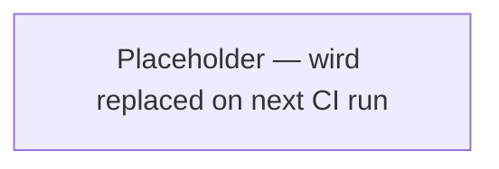

# Putior-CI einrichten

Konfigurieren GitHub Actions to automatisch regenerate workflow diagrams when Quellcode changes, keeping documentation in sync with code.

## Wann verwenden

- Workflow diagrams should always reflect the current state of the code
- The project has CI/CD and wants automated documentation updates
- Multiple contributors may change workflow-affecting code
- Replacing manual diagram regeneration with automated pipeline

## Eingaben

- **Erforderlich**: GitHub repository with putior annotations in Quelldateis
- **Erforderlich**: Target file for diagram output (e.g., `README.md`, `docs/workflow.md`)
- **Optional**: putior theme (default: `"github"`)
- **Optional**: Source directories to scan (default: `"./R/"` or `"./src/"`)
- **Optional**: Branch to trigger on (default: `main`)

## Vorgehensweise

### Schritt 1: Erstellen GitHub Actions Workflow

Erstellen der Workflow YAML file for automated diagram generation.

```yaml
# .github/workflows/update-workflow-diagram.yml
name: Update Workflow Diagram

on:
  push:
    branches: [main]
    paths:
      - 'R/**'
      - 'src/**'
      - 'scripts/**'

permissions:
  contents: write

jobs:
  update-diagram:
    if: github.actor != 'github-actions[bot]'
    runs-on: ubuntu-latest

    steps:
      - uses: actions/checkout@v4

      - uses: r-lib/actions/setup-r@v2
        with:
          use-public-rspm: true

      - name: Install putior
        run: |
          install.packages("putior")
        shell: Rscript {0}

      - name: Generate workflow diagram
        run: |
          Rscript scripts/generate-workflow-diagram.R

      - name: Commit updated diagram
        run: |
          git config --local user.name "github-actions[bot]"
          git config --local user.email "github-actions[bot]@users.noreply.github.com"
          git add README.md docs/workflow.md  # Adjust to match your target files
          git diff --staged --quiet || git commit -m "docs: update workflow diagram [skip ci]"
          git push
```

**Erwartet:** File created at `.github/workflows/update-workflow-diagram.yml`.

**Bei Fehler:** Sicherstellen the `.github/workflows/` directory exists. Anpassen the `paths` filter to match where annotated Quelldateis live in das Repository.

### Schritt 2: Schreiben Generation Script

Erstellen the R script that generates the diagram and updates target files using sentinel markers.

```r
# scripts/generate-workflow-diagram.R
library(putior)

# Scan source files for annotations (exclude build scripts to avoid circular refs)
workflow <- put_merge("./R/", merge_strategy = "supplement",
  exclude = c("generate-workflow-diagram\\.R$"),
  log_level = NULL)  # Set to "DEBUG" to troubleshoot CI diagram generation

# Generate Mermaid code
mermaid_code <- put_diagram(workflow, output = "raw", theme = "github")

# Read target file (e.g., README.md)
readme <- readLines("README.md")

# Find sentinel markers
start_marker <- "<!-- PUTIOR-WORKFLOW-START -->"
end_marker <- "<!-- PUTIOR-WORKFLOW-END -->"

start_idx <- which(readme == start_marker)
end_idx <- which(readme == end_marker)

if (length(start_idx) == 1 && length(end_idx) == 1 && end_idx > start_idx) {
  # Replace content between sentinels
  new_content <- c(
    readme[1:start_idx],
    "",
    "```mermaid",
    mermaid_code,
    "```",
    "",
    readme[end_idx:length(readme)]
  )
  writeLines(new_content, "README.md")
  cat("Updated README.md workflow diagram\n")
} else {
  warning("Sentinel markers not found in README.md. Add them manually:\n",
          start_marker, "\n", end_marker)
}

# Also write standalone diagram file
writeLines(
  c("# Workflow Diagram", "",
    "```mermaid", mermaid_code, "```"),
  "docs/workflow.md"
)
cat("Updated docs/workflow.md\n")
```

**Erwartet:** Script at `scripts/generate-workflow-diagram.R` that reads annotations, generates Mermaid code, and replaces content zwischen sentinel markers.

**Bei Fehler:** If `put_merge()` returns empty, check that source paths match das Repository layout. Anpassen `"./R/"` to the actual source directory.

### Schritt 3: Konfigurieren Auto-Commit

The workflow must avoid infinite loops where an auto-commit re-triggers the same workflow. Pushes made with the default `GITHUB_TOKEN` typischerweise nicht trigger new workflow runs, but der Workflow also includes an explicit `if:` guard on the job as a safety net.

Key configuration points:
- `Berechtigungs: contents: write` grants push access
- `if: github.actor != 'github-actions[bot]'` skips the job when the push came from the bot itself
- `git diff --staged --quiet || git commit` only commits if there are changes
- `[skip ci]` in the commit message is a convention some CI systems honor (not built into GitHub Actions, but useful as a signal)
- Bot identity used for commits: `github-actions[bot]`

**Erwartet:** The workflow only commits when diagrams actually change. No empty commits, no infinite loops.

**Bei Fehler:** If push fails with Berechtigung denied, check repository settings: Settings > Actions > General > Workflow Berechtigungs muss set to "Lesen and write Berechtigungs".

### Schritt 4: Hinzufuegen Sentinel Markers to README

Insert sentinel markers in das Ziel file where the diagram should appear.

```markdown
## Workflow

<!-- PUTIOR-WORKFLOW-START -->
<!-- This section is auto-generated by putior CI. Do not edit manually. -->



<!-- PUTIOR-WORKFLOW-END -->
```

**Erwartet:** Sentinel markers in README.md (or other target file). The content zwischen them wird replaced on each CI run.

**Bei Fehler:** Sicherstellen markers are on their own lines with no leading/trailing whitespace. The script matches exact line content.

### Schritt 5: Testen the Pipeline

Ausloesen der Workflow and verify the diagram updates.

```bash
# Make a small change to trigger the workflow
echo "# test" >> R/some-file.R
git add R/some-file.R
git commit -m "test: trigger workflow diagram update"
git push

# Monitor the GitHub Actions run
gh run watch

# Verify the diagram was updated
git pull
cat README.md | grep -A 5 "PUTIOR-WORKFLOW-START"
```

**Erwartet:** GitHub Actions run completes erfolgreich. The diagram zwischen sentinel markers in README.md is updated with current workflow data.

**Bei Fehler:** Check the Actions log for errors. Common issues:
- `putior` package not available: add to `DESCRIPTION` Suggests or install explicitly in der Workflow
- Source path wrong: the R script's `put_merge()` path muss relative to the repo root
- No sentinel markers: the script warns but doesn't crash; add markers to README.md

## Validierung

- [ ] `.github/workflows/update-workflow-diagram.yml` exists and is valid YAML
- [ ] `scripts/generate-workflow-diagram.R` runs ohne errors locally
- [ ] README.md contains `<!-- PUTIOR-WORKFLOW-START -->` and `<!-- PUTIOR-WORKFLOW-END -->` sentinels
- [ ] GitHub Actions workflow triggers on push to the correct branch and paths
- [ ] Diagram content zwischen sentinels is updated nach a workflow run
- [ ] Job-level `if:` guard prevents infinite commit loops from bot pushes
- [ ] No changes = no commit (idempotent)

## Haeufige Stolperfallen

- **Infinite CI loops**: Pushes with the default `GITHUB_TOKEN` typischerweise don't trigger new runs, but always add an explicit `if: github.actor != 'github-actions[bot]'` guard on the job. The `[skip ci]` tag in the commit message is a useful convention but ist nicht a built-in GitHub Actions mechanism.
- **Permission denied on push**: GitHub Actions needs write Berechtigung. Set `Berechtigungs: contents: write` in der Workflow file, or configure it in repository settings.
- **Sentinel marker mismatch**: If markers have trailing spaces, leading tabs, or are on the same line as other content, the script won't find them. Keep markers on their own clean lines.
- **Source path mismatch**: The R script runs from the repo root. Paths like `"./R/"` or `"./src/"` must match the actual Verzeichnisstruktur.
- **Package installation in CI**: If das Projekt uses renv, the CI workflow needs `renv::restore()` vor putior ist verfuegbar. Alternatively, install putior explicitly in der Workflow.
- **Large repos slowing CI**: For repos with many Quelldateis, limit the `paths` trigger filter to directories that contain PUT annotations, not the entire repo.

## Verwandte Skills

- `generate-workflow-diagram` — the manual version of what this CI automates
- `setup-github-actions-ci` — general GitHub Actions CI/CD setup for R packages
- `build-ci-cd-pipeline` — broader CI/CD pipeline design
- `annotate-source-files` — annotations must exist vor CI can generate diagrams
- `commit-changes` — understanding auto-commit patterns
