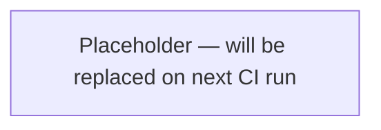

# Set Up putior CI/CD

Configurar GitHub Actions para regenerar automáticamente diagramas de flujo de trabajo cuando el código fuente cambia, manteniendo la documentación sincronizada con el código.

## Cuándo Usar

- Los diagramas de flujo de trabajo deben siempre reflejar el estado actual del código
- El proyecto tiene CI/CD y desea actualizaciones automáticas de documentación
- Múltiples contribuidores pueden cambiar código que afecta el flujo de trabajo
- Reemplazar la regeneración manual de diagramas con un pipeline automatizado

## Entradas

- **Requerido**: Repositorio de GitHub con anotaciones putior en archivos fuente
- **Requerido**: Archivo destino para la salida del diagrama (ej., `README.md`, `docs/workflow.md`)
- **Opcional**: Tema de putior (por defecto: `"github"`)
- **Opcional**: Directorios fuente a escanear (por defecto: `"./R/"` o `"./src/"`)
- **Opcional**: Rama para activar (por defecto: `main`)

## Procedimiento

### Paso 1: Crear el Workflow de GitHub Actions

Crear el archivo YAML del workflow para generación automatizada de diagramas.

```yaml
# .github/workflows/update-workflow-diagram.yml
name: Update Workflow Diagram

on:
  push:
    branches: [main]
    paths:
      - 'R/**'
      - 'src/**'
      - 'scripts/**'

permissions:
  contents: write

jobs:
  update-diagram:
    if: github.actor != 'github-actions[bot]'
    runs-on: ubuntu-latest

    steps:
      - uses: actions/checkout@v4

      - uses: r-lib/actions/setup-r@v2
        with:
          use-public-rspm: true

      - name: Install putior
        run: |
          install.packages("putior")
        shell: Rscript {0}

      - name: Generate workflow diagram
        run: |
          Rscript scripts/generate-workflow-diagram.R

      - name: Commit updated diagram
        run: |
          git config --local user.name "github-actions[bot]"
          git config --local user.email "github-actions[bot]@users.noreply.github.com"
          git add README.md docs/workflow.md  # Adjust to match your target files
          git diff --staged --quiet || git commit -m "docs: update workflow diagram [skip ci]"
          git push
```

**Esperado:** Archivo creado en `.github/workflows/update-workflow-diagram.yml`.

**En caso de fallo:** Asegurar que el directorio `.github/workflows/` exista. Ajustar el filtro `paths` para coincidir con donde viven los archivos fuente anotados en el repositorio.

### Paso 2: Escribir el Script de Generación

Crear el script R que genera el diagrama y actualiza los archivos destino usando marcadores centinela.

```r
# scripts/generate-workflow-diagram.R
library(putior)

# Scan source files for annotations (exclude build scripts to avoid circular refs)
workflow <- put_merge("./R/", merge_strategy = "supplement",
  exclude = c("generate-workflow-diagram\\.R$"),
  log_level = NULL)  # Set to "DEBUG" to troubleshoot CI diagram generation

# Generate Mermaid code
mermaid_code <- put_diagram(workflow, output = "raw", theme = "github")

# Read target file (e.g., README.md)
readme <- readLines("README.md")

# Find sentinel markers
start_marker <- "<!-- PUTIOR-WORKFLOW-START -->"
end_marker <- "<!-- PUTIOR-WORKFLOW-END -->"

start_idx <- which(readme == start_marker)
end_idx <- which(readme == end_marker)

if (length(start_idx) == 1 && length(end_idx) == 1 && end_idx > start_idx) {
  # Replace content between sentinels
  new_content <- c(
    readme[1:start_idx],
    "",
    "```mermaid",
    mermaid_code,
    "```",
    "",
    readme[end_idx:length(readme)]
  )
  writeLines(new_content, "README.md")
  cat("Updated README.md workflow diagram\n")
} else {
  warning("Sentinel markers not found in README.md. Add them manually:\n",
          start_marker, "\n", end_marker)
}

# Also write standalone diagram file
writeLines(
  c("# Workflow Diagram", "",
    "```mermaid", mermaid_code, "```"),
  "docs/workflow.md"
)
cat("Updated docs/workflow.md\n")
```

**Esperado:** Script en `scripts/generate-workflow-diagram.R` que lee anotaciones, genera código Mermaid y reemplaza contenido entre marcadores centinela.

**En caso de fallo:** Si `put_merge()` retorna vacío, verificar que las rutas fuente coincidan con la estructura del repositorio. Ajustar `"./R/"` al directorio fuente real.

### Paso 3: Configurar Auto-Commit

El workflow debe evitar bucles infinitos donde un auto-commit re-activa el mismo workflow. Los pushes hechos con el `GITHUB_TOKEN` por defecto típicamente no activan nuevas ejecuciones del workflow, pero el workflow también incluye una guarda explícita `if:` en el job como red de seguridad.

Puntos clave de configuración:
- `permissions: contents: write` otorga acceso de push
- `if: github.actor != 'github-actions[bot]'` omite el job cuando el push proviene del bot mismo
- `git diff --staged --quiet || git commit` solo hace commit si hay cambios
- `[skip ci]` en el mensaje de commit es una convención que algunos sistemas CI honran (no está integrado en GitHub Actions, pero es útil como señal)
- Identidad del bot usada para commits: `github-actions[bot]`

**Esperado:** El workflow solo hace commit cuando los diagramas realmente cambian. Sin commits vacíos, sin bucles infinitos.

**En caso de fallo:** Si el push falla con permiso denegado, verificar la configuración del repositorio: Settings > Actions > General > Workflow permissions debe estar configurado como "Read and write permissions".

### Paso 4: Agregar Marcadores Centinela al README

Insertar marcadores centinela en el archivo destino donde el diagrama debe aparecer.

```markdown
## Workflow

<!-- PUTIOR-WORKFLOW-START -->
<!-- This section is auto-generated by putior CI. Do not edit manually. -->



<!-- PUTIOR-WORKFLOW-END -->
```

**Esperado:** Marcadores centinela en README.md (u otro archivo destino). El contenido entre ellos será reemplazado en cada ejecución de CI.

**En caso de fallo:** Asegurar que los marcadores estén en sus propias líneas sin espacios iniciales/finales. El script busca coincidencia exacta del contenido de la línea.

### Paso 5: Probar el Pipeline

Activar el workflow y verificar que el diagrama se actualice.

```bash
# Make a small change to trigger the workflow
echo "# test" >> R/some-file.R
git add R/some-file.R
git commit -m "test: trigger workflow diagram update"
git push

# Monitor the GitHub Actions run
gh run watch

# Verify the diagram was updated
git pull
cat README.md | grep -A 5 "PUTIOR-WORKFLOW-START"
```

**Esperado:** La ejecución de GitHub Actions se completa exitosamente. El diagrama entre marcadores centinela en README.md se actualiza con los datos de flujo de trabajo actuales.

**En caso de fallo:** Verificar el log de Actions para errores. Problemas comunes:
- Paquete `putior` no disponible: agregar a Suggests en `DESCRIPTION` o instalar explícitamente en el workflow
- Ruta fuente incorrecta: la ruta de `put_merge()` en el script R debe ser relativa a la raíz del repositorio
- Sin marcadores centinela: el script avisa pero no falla; agregar marcadores al README.md

## Validación

- [ ] `.github/workflows/update-workflow-diagram.yml` existe y es YAML válido
- [ ] `scripts/generate-workflow-diagram.R` se ejecuta sin errores localmente
- [ ] README.md contiene centinelas `<!-- PUTIOR-WORKFLOW-START -->` y `<!-- PUTIOR-WORKFLOW-END -->`
- [ ] El workflow de GitHub Actions se activa con push a la rama y rutas correctas
- [ ] El contenido del diagrama entre centinelas se actualiza después de una ejecución del workflow
- [ ] La guarda `if:` a nivel de job previene bucles infinitos de commits del bot
- [ ] Sin cambios = sin commit (idempotente)

## Errores Comunes

- **Bucles infinitos de CI**: Los pushes con el `GITHUB_TOKEN` por defecto típicamente no activan nuevas ejecuciones, pero siempre agregar una guarda explícita `if: github.actor != 'github-actions[bot]'` en el job. La etiqueta `[skip ci]` en el mensaje de commit es una convención útil pero no es un mecanismo integrado de GitHub Actions.
- **Permiso denegado en push**: GitHub Actions necesita permiso de escritura. Configurar `permissions: contents: write` en el archivo de workflow, o configurarlo en la configuración del repositorio.
- **Desajuste de marcadores centinela**: Si los marcadores tienen espacios finales, tabulaciones iniciales o están en la misma línea que otro contenido, el script no los encontrará. Mantener los marcadores en sus propias líneas limpias.
- **Desajuste de ruta fuente**: El script R se ejecuta desde la raíz del repositorio. Rutas como `"./R/"` o `"./src/"` deben coincidir con la estructura de directorios real.
- **Instalación de paquetes en CI**: Si el proyecto usa renv, el workflow de CI necesita `renv::restore()` antes de que putior esté disponible. Alternativamente, instalar putior explícitamente en el workflow.
- **Repos grandes ralentizando CI**: Para repos con muchos archivos fuente, limitar el filtro de activación `paths` a directorios que contengan anotaciones PUT, no el repositorio completo.

## Habilidades Relacionadas

- `generate-workflow-diagram` — la versión manual de lo que este CI automatiza
- `setup-github-actions-ci` — configuración general de GitHub Actions CI/CD para paquetes R
- `build-ci-cd-pipeline` — diseño más amplio de pipelines CI/CD
- `annotate-source-files` — las anotaciones deben existir antes de que CI pueda generar diagramas
- `commit-changes` — entender patrones de auto-commit
