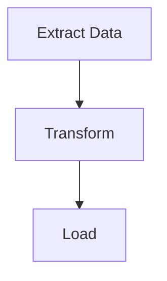

# ワークフロー図の生成

putiorワークフローデータからテーマ付きMermaidフローチャート図を生成し、ドキュメントに埋め込む。

## 使用タイミング

- ソースファイルのアノテーション後に視覚的な図を生成する準備ができた時
- ワークフロー変更後に図を再生成する時
- 異なるオーディエンスのためにテーマや出力形式を切り替える時
- README、Quarto、またはR Markdownドキュメントにワークフロー図を埋め込む時

## 入力

- **必須**: `put()`、`put_auto()`、または `put_merge()` からのワークフローデータ
- **任意**: テーマ名（デフォルト: `"light"`; オプション: light, dark, auto, minimal, github, viridis, magma, plasma, cividis）
- **任意**: 出力先: コンソール、ファイルパス、クリップボード、または生文字列
- **任意**: インタラクティブ機能: `show_source_info`、`enable_clicks`

## 手順

### ステップ1: ワークフローデータの抽出

3つのソースのいずれかからワークフローデータを取得する。

```r
library(putior)

# From manual annotations
workflow <- put("./src/")

# From manual annotations, excluding specific files
workflow <- put("./src/", exclude = c("build-workflow\\.R$", "test_"))

# From auto-detection only
workflow <- put_auto("./src/")

# From merged (manual + auto)
workflow <- put_merge("./src/", merge_strategy = "supplement")
```

ワークフローデータフレームにはアノテーションからの `node_type` 列が含まれる場合がある。ノードタイプはMermaidの図形を制御する:

| `node_type` | Mermaid図形 | 用途 |
|-------------|---------------|----------|
| `"input"` | スタジアム `([...])` | データソース、設定ファイル |
| `"output"` | サブルーチン `[[...]]` | 生成されたアーティファクト、レポート |
| `"process"` | 長方形 `[...]` | 処理ステップ（デフォルト） |
| `"decision"` | ひし形 `{...}` | 条件分岐ロジック |
| `"start"` / `"end"` | スタジアム `([...])` | エントリ/ターミナルノード |

各 `node_type` は、テーマベースのスタイリング用に対応するCSSクラス（例: `class nodeId input;`）も受け取る。

**期待結果:** `id`、`label` を含み、任意で `input`、`output`、`source_file`、`node_type` 列を含む1行以上のデータフレーム。

**失敗時:** データフレームが空の場合、アノテーションまたはパターンが見つからなかった。まず `analyze-codebase-workflow` を実行するか、`put("./src/", validate = TRUE)` でアノテーションが構文的に有効であることを確認する。

### ステップ2: テーマとオプションの選択

ターゲットオーディエンスに適したテーマを選択する。

```r
# List all available themes
get_diagram_themes()

# Standard themes
# "light"   — Default, bright colors
# "dark"    — For dark mode environments
# "auto"    — GitHub-adaptive with solid colors
# "minimal" — Grayscale, print-friendly
# "github"  — Optimized for GitHub README files

# Colorblind-safe themes (viridis family)
# "viridis" — Purple→Blue→Green→Yellow, general accessibility
# "magma"   — Purple→Red→Yellow, high contrast for print
# "plasma"  — Purple→Pink→Orange→Yellow, presentations
# "cividis" — Blue→Gray→Yellow, maximum accessibility (no red-green)
```

追加パラメータ:
- `direction`: 図のフロー方向 — `"TD"`（上から下、デフォルト）、`"LR"`（左から右）、`"RL"`、`"BT"`
- `show_artifacts`: `TRUE`/`FALSE` — アーティファクトノード（ファイル、データ）を表示; 大きなワークフローではノイズが多くなる可能性がある（例: 16以上の追加ノード）
- `show_workflow_boundaries`: `TRUE`/`FALSE` — 各ソースファイルのノードをMermaidサブグラフで囲む
- `source_info_style`: ソースファイル情報のノード上での表示方法（例: サブタイトルとして）
- `node_labels`: ノードラベルテキストのフォーマット

**期待結果:** テーマ名が出力される。文脈に基づいて1つを選択する。

**失敗時:** テーマ名が認識されない場合、`put_diagram()` は `"light"` にフォールバックする。スペルを確認する。

### ステップ3: `put_theme()` によるカスタムパレット（任意）

9つの組み込みテーマがプロジェクトのパレットに合わない場合、`put_theme()` でカスタムテーマを作成する。

```r
# Create custom palette — unspecified types inherit from base theme
cyberpunk <- put_theme(
  base = "dark",
  input    = c(fill = "#1a1a2e", stroke = "#00ff88", color = "#00ff88"),
  process  = c(fill = "#16213e", stroke = "#44ddff", color = "#44ddff"),
  output   = c(fill = "#0f3460", stroke = "#ff3366", color = "#ff3366"),
  decision = c(fill = "#1a1a2e", stroke = "#ffaa33", color = "#ffaa33")
)

# Use the palette parameter (overrides theme when provided)
mermaid_content <- put_diagram(workflow, palette = cyberpunk, output = "raw")
writeLines(mermaid_content, "workflow.mmd")
```

`put_theme()` は `input`、`process`、`output`、`decision`、`artifact`、`start`、`end` のノードタイプを受け付ける。各タイプは名前付きベクトル `c(fill = "#hex", stroke = "#hex", color = "#hex")` を取る。未設定のタイプは `base` テーマから継承される。

**期待結果:** カスタムclassDefラインを含むMermaid出力。`node_type` による図形は保持され、色のみが変更される。すべてのノードタイプは `stroke-width:2px` を使用 — `put_theme()` によるオーバーライドは現在サポートされていない。

**失敗時:** パレットオブジェクトが `putior_theme` クラスでない場合、`put_diagram()` は説明的なエラーを発生させる。生のリストではなく `put_theme()` の戻り値を渡していることを確認する。

**フォールバック — 手動classDef置換:** `put_theme()` が提供する以上の細かい制御が必要な場合（例：タイプごとのストローク幅）、ベーステーマで生成してclassDefラインを手動で置換する:

```r
mermaid_content <- put_diagram(workflow, theme = "dark", output = "raw")
lines <- strsplit(mermaid_content, "\n")[[1]]
lines <- lines[!grepl("^\\s*classDef ", lines)]
custom_defs <- c("  classDef input fill:#1a1a2e,stroke:#00ff88,stroke-width:3px,color:#00ff88")
mermaid_content <- paste(c(lines, custom_defs), collapse = "\n")
```

### ステップ4: Mermaid出力の生成

希望の出力モードで図を生成する。

```r
# Print to console (default)
cat(put_diagram(workflow, theme = "github"))

# Save to file
writeLines(put_diagram(workflow, theme = "github"), "docs/workflow.md")

# Get raw string for embedding
mermaid_code <- put_diagram(workflow, output = "raw", theme = "github")

# With source file info (shows which file each node comes from)
cat(put_diagram(workflow, theme = "github", show_source_info = TRUE))

# With clickable nodes (for VS Code, RStudio, or file:// protocol)
cat(put_diagram(workflow,
  theme = "github",
  enable_clicks = TRUE,
  click_protocol = "vscode"  # or "rstudio", "file"
))

# Full-featured
cat(put_diagram(workflow,
  theme = "viridis",
  show_source_info = TRUE,
  enable_clicks = TRUE,
  click_protocol = "vscode"
))
```

**期待結果:** `flowchart TD`（または方向に応じて `LR`）で始まる有効なMermaidコード。ノードがデータフローを示す矢印で接続されている。

**失敗時:** 出力がノードのない `flowchart TD` の場合、ワークフローデータフレームが空である。接続が欠落している場合、ノード間で出力ファイル名が入力ファイル名と完全に一致していることを確認する。

### ステップ5: ターゲットドキュメントへの埋め込み

適切なドキュメント形式に図を挿入する。

**GitHub README（```mermaidコードフェンス）:**
````markdown
## Workflow


````

**Quartoドキュメント（knit_childによるネイティブmermaidチャンク）:**
```r
# Chunk 1: Generate code (visible, foldable)
workflow <- put("./src/")
mermaid_code <- put_diagram(workflow, output = "raw", theme = "github")
```

```r
# Chunk 2: Output as native mermaid chunk (hidden)
#| output: asis
#| echo: false
mermaid_chunk <- paste0("```{mermaid}\n", mermaid_code, "\n```")
cat(knitr::knit_child(text = mermaid_chunk, quiet = TRUE))
```

**R Markdown（mermaid.js CDNまたはDiagrammeR使用）:**
```r
DiagrammeR::mermaid(put_diagram(workflow, output = "raw"))
```

**期待結果:** ターゲット形式で図が正しくレンダリングされること。GitHubはmermaidコードフェンスをネイティブにレンダリングする。

**失敗時:** GitHubが図をレンダリングしない場合、コードフェンスが正確に ` ```mermaid ` を使用していることを確認する（追加属性なし）。Quartoの場合、`{mermaid}` チャンクでの直接変数補間はサポートされていないため、`knit_child()` アプローチが使用されていることを確認する。

## バリデーション

- [ ] `put_diagram()` が有効なMermaidコードを生成する（`flowchart` で始まる）
- [ ] 期待されるすべてのノードが図に表示される
- [ ] 接続されたノード間にデータフロー接続（矢印）が存在する
- [ ] 選択したテーマが適用されている（出力のinitブロックでテーマ固有の色を確認）
- [ ] ターゲット形式（GitHub、Quartoなど）で図が正しくレンダリングされる

## よくある落とし穴

- **空の図**: 通常 `put()` が行を返さなかったことを意味する。アノテーションが存在し構文的に有効であることを確認する
- **すべてのノードが切断**: 出力ファイル名がノード間で入力ファイル名と完全に一致する必要がある（拡張子を含む）。`data.csv` と `Data.csv` は異なる
- **GitHubでテーマが見えない**: GitHubのmermaidレンダラーはテーマサポートが限定的である。`"github"` テーマはGitHubレンダリング用に特別に設計されている。`%%{init:...}%%` テーマブロックは一部のレンダラーで無視される場合がある
- **Quartoのmermaid変数補間**: Quartoの `{mermaid}` チャンクはR変数を直接サポートしない。ステップ5で説明した `knit_child()` テクニックを使用する
- **クリック可能なノードが機能しない**: クリックディレクティブはMermaidインタラクションイベントをサポートするレンダラーが必要。GitHubの静的レンダラーはクリックをサポートしない。ローカルMermaidレンダラーまたはputior Shinyサンドボックスを使用する
- **自己参照メタパイプラインファイル**: 図を生成するビルドスクリプトを含むディレクトリをスキャンすると、重複するサブグラフIDとMermaidエラーが発生する。`exclude` パラメータを使用してスキャン時にスキップする:
  ```r
  workflow <- put("./src/", exclude = c("build-workflow\\.R$", "build-workflow\\.js$"))
  ```
- **`show_artifacts = TRUE` がノイズ過多**: 大きなプロジェクトでは多くのアーティファクトノード（10-20以上）が生成され、図が散らかる。`show_artifacts = FALSE` を使用し、`node_type` アノテーションに依存して主要な入出力を明示的にマークする

## 関連スキル

- `annotate-source-files` — 前提条件: 図の生成前にファイルがアノテーションされている必要がある
- `analyze-codebase-workflow` — 自動検出が手動アノテーションを補完できる
- `setup-putior-ci` — CI/CDでの図の再生成を自動化する
- `create-quarto-report` — Quartoレポートに図を埋め込む
- `build-pkgdown-site` — pkgdownドキュメントサイトに図を埋め込む
