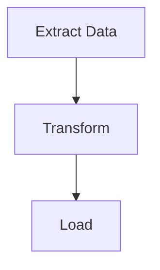

# 生工作流程圖

自 putior 工作流程資料生帶主題之 Mermaid 流程圖並嵌於文件。

## 適用時機

- 已註源檔後欲產視覺圖
- 工作流程變更後重生圖
- 為不同讀者換主題或輸出格式
- 於 README、Quarto 或 R Markdown 中嵌工作流程圖

## 輸入

- **必要**：`put()`、`put_auto()` 或 `put_merge()` 之工作流程資料
- **選擇性**：主題名（預設：`"light"`；選項：light、dark、auto、minimal、github、viridis、magma、plasma、cividis）
- **選擇性**：輸出目標：主控台、檔案路徑、剪貼簿或原始字串
- **選擇性**：互動特徵：`show_source_info`、`enable_clicks`

## 步驟

### 步驟一：提取工作流程資料

自三源之一取工作流程資料。

```r
library(putior)

# 自手動註解
workflow <- put("./src/")

# 自手動註解，排除特定檔
workflow <- put("./src/", exclude = c("build-workflow\\.R$", "test_"))

# 僅自動偵測
workflow <- put_auto("./src/")

# 合併（手動 + 自動）
workflow <- put_merge("./src/", merge_strategy = "supplement")
```

工作流程資料框可含自註解而來之 `node_type` 欄。節點類型控 Mermaid 形狀：

| `node_type` | Mermaid 形狀 | 用例 |
|-------------|---------------|----------|
| `"input"` | 體育場 `([...])` | 資料源、配置檔 |
| `"output"` | 子程序 `[[...]]` | 生成工件、報告 |
| `"process"` | 矩形 `[...]` | 處理步驟（預設） |
| `"decision"` | 菱形 `{...}` | 條件邏輯、分支 |
| `"start"` / `"end"` | 體育場 `([...])` | 入/終節點 |

每 `node_type` 亦得對應 CSS 類（如 `class nodeId input;`）以供主題式樣設。

**預期：** 資料框至少一列，含 `id`、`label` 及可選 `input`、`output`、`source_file`、`node_type` 欄。

**失敗時：** 若資料框空，則無註解或模式得。先執行 `analyze-codebase-workflow`，或以 `put("./src/", validate = TRUE)` 核註解語法有效。

### 步驟二：擇主題與選項

擇合目標讀者之主題。

```r
# 列所有可用主題
get_diagram_themes()

# 標準主題
# "light"   — 預設，明色
# "dark"    — 暗模式環境
# "auto"    — GitHub 自適應實色
# "minimal" — 灰階，宜列印
# "github"  — 為 GitHub README 優化

# 色盲安全主題（viridis 家族）
# "viridis" — 紫→藍→綠→黃，通用可及性
# "magma"   — 紫→紅→黃，列印高對比
# "plasma"  — 紫→粉→橙→黃，簡報
# "cividis" — 藍→灰→黃，最大可及性（無紅綠）
```

附加參數：
- `direction`：圖流向——`"TD"`（上下，預設）、`"LR"`（左右）、`"RL"`、`"BT"`
- `show_artifacts`：`TRUE`/`FALSE`——示工件節點（檔、資料）；大工作流程可吵（如十六加附加節點）
- `show_workflow_boundaries`：`TRUE`/`FALSE`——於 Mermaid 子圖中包每源檔之節點
- `source_info_style`：源檔資訊於節點上之顯示法（如副標）
- `node_labels`：節點標籤文字之格式

**預期：** 主題名印出。依情境擇一。

**失敗時：** 若主題名未識，`put_diagram()` 退至 `"light"`。核拼字。

### 步驟三：以 `put_theme()` 自訂調色盤（選擇性）

若九內建主題不配專案調色盤，以 `put_theme()` 建自訂主題。

```r
# 建自訂調色盤——未指定類型繼承自基主題
cyberpunk <- put_theme(
  base = "dark",
  input    = c(fill = "#1a1a2e", stroke = "#00ff88", color = "#00ff88"),
  process  = c(fill = "#16213e", stroke = "#44ddff", color = "#44ddff"),
  output   = c(fill = "#0f3460", stroke = "#ff3366", color = "#ff3366"),
  decision = c(fill = "#1a1a2e", stroke = "#ffaa33", color = "#ffaa33")
)

# 用 palette 參數（覆蓋 theme）
mermaid_content <- put_diagram(workflow, palette = cyberpunk, output = "raw")
writeLines(mermaid_content, "workflow.mmd")
```

`put_theme()` 接受 `input`、`process`、`output`、`decision`、`artifact`、`start`、`end` 節點類型。各取具名向量 `c(fill = "#hex", stroke = "#hex", color = "#hex")`。未設類型繼承自 `base` 主題。

**預期：** Mermaid 輸出含自訂 classDef 行。自 `node_type` 之節點形狀保留；僅色變。所有節點類型用 `stroke-width:2px`——`put_theme()` 目前不支援覆寫。

**失敗時：** 若調色盤物件非 `putior_theme` 類，`put_diagram()` 引描述性錯。確傳 `put_theme()` 之返回值，非原始列表。

**退路——手動 classDef 替換：** 為超越 `put_theme()` 之細粒度控制（如每類型筆寬），以基主題生成並手動替換 classDef 行：

```r
mermaid_content <- put_diagram(workflow, theme = "dark", output = "raw")
lines <- strsplit(mermaid_content, "\n")[[1]]
lines <- lines[!grepl("^\\s*classDef ", lines)]
custom_defs <- c("  classDef input fill:#1a1a2e,stroke:#00ff88,stroke-width:3px,color:#00ff88")
mermaid_content <- paste(c(lines, custom_defs), collapse = "\n")
```

### 步驟四：生 Mermaid 輸出

以所欲輸出模式產圖。

```r
# 印至主控台（預設）
cat(put_diagram(workflow, theme = "github"))

# 存至檔
writeLines(put_diagram(workflow, theme = "github"), "docs/workflow.md")

# 取原始字串以嵌入
mermaid_code <- put_diagram(workflow, output = "raw", theme = "github")

# 附源檔資訊（示每節點來自何檔）
cat(put_diagram(workflow, theme = "github", show_source_info = TRUE))

# 附可點節點（VS Code、RStudio 或 file:// 協定）
cat(put_diagram(workflow,
  theme = "github",
  enable_clicks = TRUE,
  click_protocol = "vscode"  # 或 "rstudio"、"file"
))

# 全特徵
cat(put_diagram(workflow,
  theme = "viridis",
  show_source_info = TRUE,
  enable_clicks = TRUE,
  click_protocol = "vscode"
))
```

**預期：** 有效 Mermaid 代碼以 `flowchart TD`（或依方向之 `LR`）始。節點以箭頭示資料流連。

**失敗時：** 若輸出為 `flowchart TD` 無節點，工作流程資料框空。若連結缺，核輸出檔名於節點間配合輸入檔名。

### 步驟五：嵌於目標文件

將圖插入合宜文件格式。

**GitHub README（```mermaid 代碼圍欄）：**
````markdown
## Workflow


````

**Quarto 文件（經 knit_child 之原生 mermaid 段）：**
```r
# 段一：生代碼（可見、可摺）
workflow <- put("./src/")
mermaid_code <- put_diagram(workflow, output = "raw", theme = "github")
```

```r
# 段二：輸出為原生 mermaid 段（隱藏）
#| output: asis
#| echo: false
mermaid_chunk <- paste0("```{mermaid}\n", mermaid_code, "\n```")
cat(knitr::knit_child(text = mermaid_chunk, quiet = TRUE))
```

**R Markdown（以 mermaid.js CDN 或 DiagrammeR）：**
```r
DiagrammeR::mermaid(put_diagram(workflow, output = "raw"))
```

**預期：** 圖於目標格式正確渲染。GitHub 原生渲染 mermaid 代碼圍欄。

**失敗時：** 若 GitHub 不渲染圖，確代碼圍欄用確切 ` ```mermaid `（無附屬）。Quarto 須用 `knit_child()` 法，因 `{mermaid}` 段中直接變數插值不支援。

## 驗證

- [ ] `put_diagram()` 產有效 Mermaid 代碼（以 `flowchart` 始）
- [ ] 所有預期節點現於圖
- [ ] 已連節點間有資料流連結（箭頭）
- [ ] 所擇主題已施（核輸出之 init 區塊主題專屬色）
- [ ] 圖於目標格式（GitHub、Quarto 等）正確渲染

## 常見陷阱

- **空圖**：通常示 `put()` 返回無列。核註解存且語法有效。
- **所有節點脫離**：輸出檔名須確配輸入檔名（含副檔名）putior 方能繪連結。`data.csv` 與 `Data.csv` 為不同。
- **GitHub 上主題不可見**：GitHub 之 mermaid 渲染器主題支援有限。`"github"` 主題為 GitHub 渲染所特別設計。`%%{init:...}%%` 主題區塊恐為部分渲染器忽略。
- **Quarto mermaid 變數插值**：Quarto 之 `{mermaid}` 段不支援 R 變數直接。用步驟五所述 `knit_child()` 技法。
- **可點節點不工作**：點擊指令需支援 Mermaid 互動事件之渲染器。GitHub 之靜態渲染器不支援點擊。用本地 Mermaid 渲染器或 putior Shiny 沙箱。
- **自參考元管線檔**：掃含生圖之建置腳本之目錄致重複子圖 ID 與 Mermaid 錯。用 `exclude` 參數於掃描時略之：
  ```r
  workflow <- put("./src/", exclude = c("build-workflow\\.R$", "build-workflow\\.js$"))
  ```
- **`show_artifacts = TRUE` 過吵**：大專案可生多工件節點（十至二十加），雜亂圖。用 `show_artifacts = FALSE` 並賴 `node_type` 註解明標關鍵輸入/輸出。

## 相關技能

- `annotate-source-files` — 前提：生圖前檔須已註
- `analyze-codebase-workflow` — 自動偵測可補手動註解
- `setup-putior-ci` — 於 CI/CD 中自動重生圖
- `create-quarto-report` — 於 Quarto 報告中嵌圖
- `build-pkgdown-site` — 於 pkgdown 文件站中嵌圖
