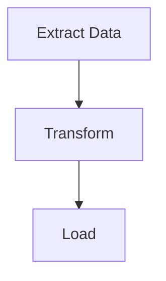

# 生工作流圖

由 putior 工作流數據生題 Mermaid 流程圖並嵌文檔。

## 用

- 源檔標註後欲出視覺圖
- 工作流變後重生圖
- 為不同受眾換題或出格式
- 嵌工作流圖於 README、Quarto、R Markdown

## 入

- **必**：工作流數據（由 `put()`、`put_auto()`、`put_merge()`）
- **可**：題名（默 `"light"`；選：light、dark、auto、minimal、github、viridis、magma、plasma、cividis）
- **可**：出目標：控台、檔徑、剪貼、原串
- **可**：交互：`show_source_info`、`enable_clicks`

## 行

### 一：取工作流數據

由三源之一取工作流數據。

```r
library(putior)

# From manual annotations
workflow <- put("./src/")

# From manual annotations, excluding specific files
workflow <- put("./src/", exclude = c("build-workflow\\.R$", "test_"))

# From auto-detection only
workflow <- put_auto("./src/")

# From merged (manual + auto)
workflow <- put_merge("./src/", merge_strategy = "supplement")
```

工作流數據幀或含來自標註之 `node_type` 列。節點型控 Mermaid 形：

| `node_type` | Mermaid Shape | Use Case |
|-------------|---------------|----------|
| `"input"` | Stadium `([...])` | Data sources, configuration files |
| `"output"` | Subroutine `[[...]]` | Generated artifacts, reports |
| `"process"` | Rectangle `[...]` | Processing steps (default) |
| `"decision"` | Diamond `{...}` | Conditional logic, branching |
| `"start"` / `"end"` | Stadium `([...])` | Entry/terminal nodes |

各 `node_type` 亦得相應 CSS 類（如 `class nodeId input;`）供題化。

得：數據幀至少一列，含 `id`、`label`，可選 `input`、`output`、`source_file`、`node_type` 列。

敗：數據幀空→無標註或模式。先行 `analyze-codebase-workflow`，或驗標註合語法用 `put("./src/", validate = TRUE)`。

### 二：擇題與選項

依目標受眾擇題。

```r
# List all available themes
get_diagram_themes()

# Standard themes
# "light"   — Default, bright colors
# "dark"    — For dark mode environments
# "auto"    — GitHub-adaptive with solid colors
# "minimal" — Grayscale, print-friendly
# "github"  — Optimized for GitHub README files

# Colorblind-safe themes (viridis family)
# "viridis" — Purple→Blue→Green→Yellow, general accessibility
# "magma"   — Purple→Red→Yellow, high contrast for print
# "plasma"  — Purple→Pink→Orange→Yellow, presentations
# "cividis" — Blue→Gray→Yellow, maximum accessibility (no red-green)
```

他參：
- `direction`：圖向——`"TD"`（上下，默）、`"LR"`（左右）、`"RL"`、`"BT"`
- `show_artifacts`：`TRUE`/`FALSE`——示物件節點（檔、數據）；大工作流或噪（如 16+ 額外節點）
- `show_workflow_boundaries`：`TRUE`/`FALSE`——各源檔節點裹入 Mermaid 子圖
- `source_info_style`：源檔訊於節點顯示法（如副題）
- `node_labels`：節點標籤文格式

得：題名印出。依脈絡擇一。

敗：題名未識→`put_diagram()` 回退 `"light"`。察拼法。

### 三：用 `put_theme()` 自定調色（可選）

九內建題不合→以 `put_theme()` 造自定題。

```r
# Create custom palette — unspecified types inherit from base theme
cyberpunk <- put_theme(
  base = "dark",
  input    = c(fill = "#1a1a2e", stroke = "#00ff88", color = "#00ff88"),
  process  = c(fill = "#16213e", stroke = "#44ddff", color = "#44ddff"),
  output   = c(fill = "#0f3460", stroke = "#ff3366", color = "#ff3366"),
  decision = c(fill = "#1a1a2e", stroke = "#ffaa33", color = "#ffaa33")
)

# Use the palette parameter (overrides theme when provided)
mermaid_content <- put_diagram(workflow, palette = cyberpunk, output = "raw")
writeLines(mermaid_content, "workflow.mmd")
```

`put_theme()` 受 `input`、`process`、`output`、`decision`、`artifact`、`start`、`end` 節點型。各取命名向量 `c(fill = "#hex", stroke = "#hex", color = "#hex")`。未設型承基題。

得：Mermaid 出具自定 classDef 行。`node_type` 之形保，僅色變。諸節點型用 `stroke-width:2px`——`put_theme()` 當前未支援覆寫。

敗：調色非 `putior_theme` 類→`put_diagram()` 發明誤。確傳 `put_theme()` 返值，非原列。

**回退——手動 classDef 替換：**欲 `put_theme()` 外之細控（如各型畫筆寬），用基題生後手換 classDef：

```r
mermaid_content <- put_diagram(workflow, theme = "dark", output = "raw")
lines <- strsplit(mermaid_content, "\n")[[1]]
lines <- lines[!grepl("^\\s*classDef ", lines)]
custom_defs <- c("  classDef input fill:#1a1a2e,stroke:#00ff88,stroke-width:3px,color:#00ff88")
mermaid_content <- paste(c(lines, custom_defs), collapse = "\n")
```

### 四：生 Mermaid 出

按所需出模生圖。

```r
# Print to console (default)
cat(put_diagram(workflow, theme = "github"))

# Save to file
writeLines(put_diagram(workflow, theme = "github"), "docs/workflow.md")

# Get raw string for embedding
mermaid_code <- put_diagram(workflow, output = "raw", theme = "github")

# With source file info (shows which file each node comes from)
cat(put_diagram(workflow, theme = "github", show_source_info = TRUE))

# With clickable nodes (for VS Code, RStudio, or file:// protocol)
cat(put_diagram(workflow,
  theme = "github",
  enable_clicks = TRUE,
  click_protocol = "vscode"  # or "rstudio", "file"
))

# Full-featured
cat(put_diagram(workflow,
  theme = "viridis",
  show_source_info = TRUE,
  enable_clicks = TRUE,
  click_protocol = "vscode"
))
```

得：有效 Mermaid 碼以 `flowchart TD`（或依向為 `LR`）開。諸節點以箭頭連示數據流。

敗：出為 `flowchart TD` 無節點→數據幀空。連缺→察諸節點間出檔名符入檔名。

### 五：嵌目標文檔

將圖插入適文檔格式。

**GitHub README（```mermaid 碼欄）：**
````markdown
## Workflow


````

**Quarto 文（原生 mermaid 塊經 knit_child）：**
```r
# Chunk 1: Generate code (visible, foldable)
workflow <- put("./src/")
mermaid_code <- put_diagram(workflow, output = "raw", theme = "github")
```

```r
# Chunk 2: Output as native mermaid chunk (hidden)
#| output: asis
#| echo: false
mermaid_chunk <- paste0("```{mermaid}\n", mermaid_code, "\n```")
cat(knitr::knit_child(text = mermaid_chunk, quiet = TRUE))
```

**R Markdown（mermaid.js CDN 或 DiagrammeR）：**
```r
DiagrammeR::mermaid(put_diagram(workflow, output = "raw"))
```

得：圖於目標格式正確繪。GitHub 原生繪 mermaid 碼欄。

敗：GitHub 不繪→確碼欄用精確 ` ```mermaid `（無額屬性）。Quarto→用 `knit_child()` 法；`{mermaid}` 塊不支援變量插值。

## 驗

- [ ] `put_diagram()` 生有效 Mermaid（以 `flowchart` 開）
- [ ] 諸預期節點皆現於圖
- [ ] 連節點間之數據流連（箭頭）具
- [ ] 所選題已應（察出之 init 塊含題特色）
- [ ] 圖於目標格式（GitHub、Quarto 等）正確繪

## 忌

- **空圖**：常因 `put()` 返無列。察標註存且合語法
- **諸節點皆斷**：出檔名須精確符入檔名（含副檔）供 putior 連。`data.csv` 與 `Data.csv` 異
- **題於 GitHub 不顯**：GitHub 之 mermaid 繪器題支援有限。`"github"` 題專設。`%%{init:...}%%` 題塊或被部分繪器忽
- **Quarto mermaid 變量插值**：Quarto 之 `{mermaid}` 塊不直支 R 變量。用步五之 `knit_child()` 法
- **可點節點不作**：點指令需支 Mermaid 交互事件之繪器。GitHub 靜繪器不支點。用本機 Mermaid 繪器或 putior Shiny 沙盒
- **自參元管線檔**：掃含生圖建腳本之目錄→子圖 ID 重並 Mermaid 誤。用 `exclude` 於掃時略：
  ```r
  workflow <- put("./src/", exclude = c("build-workflow\\.R$", "build-workflow\\.js$"))
  ```
- **`show_artifacts = TRUE` 過噪**：大項目或生眾物件節點（10-20+），亂圖。用 `show_artifacts = FALSE` 並倚 `node_type` 標註顯標關鍵入出

## 參

- `annotate-source-files`
- `analyze-codebase-workflow`
- `setup-putior-ci`
- `create-quarto-report`
- `build-pkgdown-site`
