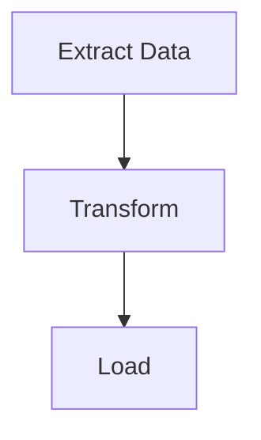

# 工作流圖之生

自 putior 工作流資料生主題 Mermaid 流程圖，並嵌入文檔。

## 用時

- 已注源檔而可生可視圖
- 工作流變更後重生圖
- 為異眾切換主題或輸出格式
- 嵌工作流圖於 README、Quarto、R Markdown 文檔

## 入

- **必要**：自 `put()`、`put_auto()`、或 `put_merge()` 之工作流資料
- **可選**：主題名（默：`"light"`；可選：light、dark、auto、minimal、github、viridis、magma、plasma、cividis）
- **可選**：輸出目標：控制台、檔路徑、剪貼板、原串
- **可選**：交互功能：`show_source_info`、`enable_clicks`

## 法

### 第一步：抽工作流資料

自三源之一獲工作流資料。

```r
library(putior)

# From manual annotations
workflow <- put("./src/")

# From manual annotations, excluding specific files
workflow <- put("./src/", exclude = c("build-workflow\\.R$", "test_"))

# From auto-detection only
workflow <- put_auto("./src/")

# From merged (manual + auto)
workflow <- put_merge("./src/", merge_strategy = "supplement")
```

工作流資料框可含注解之 `node_type` 列。節點類型控 Mermaid 形狀：

| `node_type` | Mermaid Shape | Use Case |
|-------------|---------------|----------|
| `"input"` | Stadium `([...])` | Data sources, configuration files |
| `"output"` | Subroutine `[[...]]` | Generated artifacts, reports |
| `"process"` | Rectangle `[...]` | Processing steps (default) |
| `"decision"` | Diamond `{...}` | Conditional logic, branching |
| `"start"` / `"end"` | Stadium `([...])` | Entry/terminal nodes |

每 `node_type` 亦得對應 CSS 類（如 `class nodeId input;`）供主題樣式。

**得：** 資料框至少一行，含 `id`、`label`、可選 `input`、`output`、`source_file`、`node_type` 列。

**敗則：** 若資料框空，無注解或模式被察。先行 `analyze-codebase-workflow`，或以 `put("./src/", validate = TRUE)` 察注解語法有效。

### 第二步：擇主題與選項

擇合目標眾之主題。

```r
# List all available themes
get_diagram_themes()

# Standard themes
# "light"   — Default, bright colors
# "dark"    — For dark mode environments
# "auto"    — GitHub-adaptive with solid colors
# "minimal" — Grayscale, print-friendly
# "github"  — Optimized for GitHub README files

# Colorblind-safe themes (viridis family)
# "viridis" — Purple→Blue→Green→Yellow, general accessibility
# "magma"   — Purple→Red→Yellow, high contrast for print
# "plasma"  — Purple→Pink→Orange→Yellow, presentations
# "cividis" — Blue→Gray→Yellow, maximum accessibility (no red-green)
```

附加參數：
- `direction`：圖流向——`"TD"`（上下，默）、`"LR"`（左右）、`"RL"`、`"BT"`
- `show_artifacts`：`TRUE`/`FALSE`——顯成品節（檔、資料）；大工作流或雜亂（如 16+ 額外節）
- `show_workflow_boundaries`：`TRUE`/`FALSE`——將每源檔節包入 Mermaid 子圖
- `source_info_style`：節上源檔資訊之顯方式（如副題）
- `node_labels`：節標文字格式

**得：** 主題名印出。依語境擇一。

**敗則：** 若主題名不識，`put_diagram()` 退為 `"light"`。察拼寫。

### 第三步：自訂調色板（`put_theme()`，可選）

若九內建主題不合項目調色板，以 `put_theme()` 創自訂主題。

```r
# Create custom palette — unspecified types inherit from base theme
cyberpunk <- put_theme(
  base = "dark",
  input    = c(fill = "#1a1a2e", stroke = "#00ff88", color = "#00ff88"),
  process  = c(fill = "#16213e", stroke = "#44ddff", color = "#44ddff"),
  output   = c(fill = "#0f3460", stroke = "#ff3366", color = "#ff3366"),
  decision = c(fill = "#1a1a2e", stroke = "#ffaa33", color = "#ffaa33")
)

# Use the palette parameter (overrides theme when provided)
mermaid_content <- put_diagram(workflow, palette = cyberpunk, output = "raw")
writeLines(mermaid_content, "workflow.mmd")
```

`put_theme()` 受 `input`、`process`、`output`、`decision`、`artifact`、`start`、`end` 節點類型。各取具名向量 `c(fill = "#hex", stroke = "#hex", color = "#hex")`。未設類型承 `base` 主題。

**得：** Mermaid 輸出有自訂 classDef 行。`node_type` 之節形保留；只色變。所有節類型用 `stroke-width:2px`——`put_theme()` 現不支覆寫。

**敗則：** 若調色板非 `putior_theme` 類，`put_diagram()` 拋描述性誤。確傳 `put_theme()` 之返回值，非原列表。

**備援——手動 classDef 替換：** 若需超 `put_theme()` 之細粒（如每類型之線寬），以基礎主題生後手替 classDef 行：

```r
mermaid_content <- put_diagram(workflow, theme = "dark", output = "raw")
lines <- strsplit(mermaid_content, "\n")[[1]]
lines <- lines[!grepl("^\\s*classDef ", lines)]
custom_defs <- c("  classDef input fill:#1a1a2e,stroke:#00ff88,stroke-width:3px,color:#00ff88")
mermaid_content <- paste(c(lines, custom_defs), collapse = "\n")
```

### 第四步：生 Mermaid 輸出

依所欲輸出模式製圖。

```r
# Print to console (default)
cat(put_diagram(workflow, theme = "github"))

# Save to file
writeLines(put_diagram(workflow, theme = "github"), "docs/workflow.md")

# Get raw string for embedding
mermaid_code <- put_diagram(workflow, output = "raw", theme = "github")

# With source file info (shows which file each node comes from)
cat(put_diagram(workflow, theme = "github", show_source_info = TRUE))

# With clickable nodes (for VS Code, RStudio, or file:// protocol)
cat(put_diagram(workflow,
  theme = "github",
  enable_clicks = TRUE,
  click_protocol = "vscode"  # or "rstudio", "file"
))

# Full-featured
cat(put_diagram(workflow,
  theme = "viridis",
  show_source_info = TRUE,
  enable_clicks = TRUE,
  click_protocol = "vscode"
))
```

**得：** 有效 Mermaid 碼始以 `flowchart TD`（或依向之 `LR`）。節以箭連示資料流。

**敗則：** 若輸出為 `flowchart TD` 無節，工作流資料框空。若連接缺，察節間輸出檔名合輸入檔名。

### 第五步：嵌目標文檔

將圖插入合適文檔格式。

**GitHub README（```mermaid 碼柵）：**
````markdown
## Workflow


````

**Quarto 文檔（以 knit_child 之原生 mermaid 塊）：**
```r
# Chunk 1: Generate code (visible, foldable)
workflow <- put("./src/")
mermaid_code <- put_diagram(workflow, output = "raw", theme = "github")
```

```r
# Chunk 2: Output as native mermaid chunk (hidden)
#| output: asis
#| echo: false
mermaid_chunk <- paste0("```{mermaid}\n", mermaid_code, "\n```")
cat(knitr::knit_child(text = mermaid_chunk, quiet = TRUE))
```

**R Markdown（mermaid.js CDN 或 DiagrammeR）：**
```r
DiagrammeR::mermaid(put_diagram(workflow, output = "raw"))
```

**得：** 圖於目標格式正渲染。GitHub 原生渲染 mermaid 碼柵。

**敗則：** 若 GitHub 不渲染圖，確碼柵恰用 ` ```mermaid `（無額外屬性）。Quarto 者須用 `knit_child()` 法，蓋 `{mermaid}` 塊不支 R 變數直接插值。

## 驗

- [ ] `put_diagram()` 生有效 Mermaid 碼（始以 `flowchart`）
- [ ] 所有預期節現於圖
- [ ] 連節間資料流連接（箭）存
- [ ] 所擇主題已施（察輸出 init 塊之主題特定色）
- [ ] 圖於目標格式（GitHub、Quarto 等）正渲染

## 陷

- **空圖**：常示 `put()` 返無行。察注解存且語法有效
- **所有節不連**：輸出檔名須恰合輸入檔名（含副檔名）方使 putior 繪連接。`data.csv` 與 `Data.csv` 異
- **GitHub 不見主題**：GitHub 之 mermaid 渲染主題支有限。`"github"` 主題專為 GitHub 渲染設。`%%{init:...}%%` 主題塊或被某渲染忽
- **Quarto mermaid 變數插值**：Quarto 之 `{mermaid}` 塊不直支 R 變數。用第五步所述 `knit_child()` 法
- **可點節不作用**：點指令需支 Mermaid 交互事件之渲染器。GitHub 靜渲染不支點。用本地 Mermaid 渲染器或 putior Shiny 沙盒
- **自參元管線檔**：掃含生此圖之建腳本之目錄致子圖 ID 重與 Mermaid 誤。掃時以 `exclude` 參略之：
  ```r
  workflow <- put("./src/", exclude = c("build-workflow\\.R$", "build-workflow\\.js$"))
  ```
- **`show_artifacts = TRUE` 過雜**：大項目或生多成品節（10-20+），亂圖。用 `show_artifacts = FALSE` 並賴 `node_type` 注解顯標要入/出

## 參

- `annotate-source-files` — 前提：生圖前檔須注解
- `analyze-codebase-workflow` — 自動察可補手注
- `setup-putior-ci` — 於 CI/CD 自動重生圖
- `create-quarto-report` — 於 Quarto 報告嵌圖
- `build-pkgdown-site` — 於 pkgdown 文檔站嵌圖
