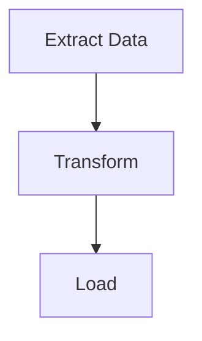

# 生成工作流图表

从 putior 工作流数据生成主题化的 Mermaid 流程图，并嵌入到文档中。

## 适用场景

- 注释源文件后准备生成可视图表
- 工作流变更后重新生成图表
- 为不同受众切换主题或输出格式
- 在 README、Quarto 或 R Markdown 文档中嵌入工作流图表

## 输入

- **必需**：来自 `put()`、`put_auto()` 或 `put_merge()` 的工作流数据
- **可选**：主题名称（默认：`"light"`；选项：light、dark、auto、minimal、github、viridis、magma、plasma、cividis）
- **可选**：输出目标：控制台、文件路径、剪贴板或原始字符串
- **可选**：交互功能：`show_source_info`、`enable_clicks`

## 步骤

### 第 1 步：提取工作流数据

从三个来源之一获取工作流数据。

```r
library(putior)

# From manual annotations
workflow <- put("./src/")

# From manual annotations, excluding specific files
workflow <- put("./src/", exclude = c("build-workflow\\.R$", "test_"))

# From auto-detection only
workflow <- put_auto("./src/")

# From merged (manual + auto)
workflow <- put_merge("./src/", merge_strategy = "supplement")
```

工作流数据框可能包含来自注释的 `node_type` 列。节点类型控制 Mermaid 形状：

| `node_type` | Mermaid 形状 | 用途 |
|-------------|-------------|------|
| `"input"` | Stadium `([...])` | 数据源、配置文件 |
| `"output"` | Subroutine `[[...]]` | 生成的工件、报告 |
| `"process"` | Rectangle `[...]` | 处理步骤（默认） |
| `"decision"` | Diamond `{...}` | 条件逻辑、分支 |
| `"start"` / `"end"` | Stadium `([...])` | 入口/终端节点 |

每个 `node_type` 还会收到相应的 CSS 类（如 `class nodeId input;`）用于基于主题的样式。

**预期结果：** 包含至少一行的数据框，包含 `id`、`label`，以及可选的 `input`、`output`、`source_file`、`node_type` 列。

**失败处理：** 如果数据框为空，表示未找到注释或模式。先运行 `analyze-codebase-workflow`，或使用 `put("./src/", validate = TRUE)` 检查注释语法是否正确。

### 第 2 步：选择主题和选项

选择适合目标受众的主题。

```r
# List all available themes
get_diagram_themes()

# Standard themes
# "light"   — Default, bright colors
# "dark"    — For dark mode environments
# "auto"    — GitHub-adaptive with solid colors
# "minimal" — Grayscale, print-friendly
# "github"  — Optimized for GitHub README files

# Colorblind-safe themes (viridis family)
# "viridis" — Purple→Blue→Green→Yellow, general accessibility
# "magma"   — Purple→Red→Yellow, high contrast for print
# "plasma"  — Purple→Pink→Orange→Yellow, presentations
# "cividis" — Blue→Gray→Yellow, maximum accessibility (no red-green)
```

其他参数：
- `direction`：图表流向——`"TD"`（自上而下，默认）、`"LR"`（从左到右）、`"RL"`、`"BT"`
- `show_artifacts`：`TRUE`/`FALSE`——显示工件节点（文件、数据）；大型工作流可能会很嘈杂（如 16+ 个额外节点）
- `show_workflow_boundaries`：`TRUE`/`FALSE`——将每个源文件的节点包装在 Mermaid 子图中
- `source_info_style`：源文件信息在节点上的显示方式（如作为副标题）
- `node_labels`：节点标签文本的格式

**预期结果：** 主题名称已打印。根据上下文选择一个。

**失败处理：** 如果主题名称不被识别，`put_diagram()` 回退到 `"light"`。检查拼写。

### 第 3 步：使用 `put_theme()` 自定义调色板（可选）

如果 9 个内置主题不匹配你的项目调色板，使用 `put_theme()` 创建自定义主题。

```r
# Create custom palette — unspecified types inherit from base theme
cyberpunk <- put_theme(
  base = "dark",
  input    = c(fill = "#1a1a2e", stroke = "#00ff88", color = "#00ff88"),
  process  = c(fill = "#16213e", stroke = "#44ddff", color = "#44ddff"),
  output   = c(fill = "#0f3460", stroke = "#ff3366", color = "#ff3366"),
  decision = c(fill = "#1a1a2e", stroke = "#ffaa33", color = "#ffaa33")
)

# Use the palette parameter (overrides theme when provided)
mermaid_content <- put_diagram(workflow, palette = cyberpunk, output = "raw")
writeLines(mermaid_content, "workflow.mmd")
```

`put_theme()` 接受 `input`、`process`、`output`、`decision`、`artifact`、`start` 和 `end` 节点类型。每个接受命名向量 `c(fill = "#hex", stroke = "#hex", color = "#hex")`。未设置的类型从 `base` 主题继承。

**预期结果：** 带有自定义 classDef 行的 Mermaid 输出。来自 `node_type` 的节点形状保留；只有颜色改变。所有节点类型使用 `stroke-width:2px`——当前不支持通过 `put_theme()` 覆盖。

**失败处理：** 如果调色板对象不是 `putior_theme` 类，`put_diagram()` 会抛出描述性错误。确保传递 `put_theme()` 的返回值，而非原始列表。

**备选方案——手动 classDef 替换：** 对于超出 `put_theme()` 提供的细粒度控制（如每类型的线宽），使用基础主题生成后手动替换 classDef 行：

```r
mermaid_content <- put_diagram(workflow, theme = "dark", output = "raw")
lines <- strsplit(mermaid_content, "\n")[[1]]
lines <- lines[!grepl("^\\s*classDef ", lines)]
custom_defs <- c("  classDef input fill:#1a1a2e,stroke:#00ff88,stroke-width:3px,color:#00ff88")
mermaid_content <- paste(c(lines, custom_defs), collapse = "\n")
```

### 第 4 步：生成 Mermaid 输出

以所需的输出模式生成图表。

```r
# Print to console (default)
cat(put_diagram(workflow, theme = "github"))

# Save to file
writeLines(put_diagram(workflow, theme = "github"), "docs/workflow.md")

# Get raw string for embedding
mermaid_code <- put_diagram(workflow, output = "raw", theme = "github")

# With source file info (shows which file each node comes from)
cat(put_diagram(workflow, theme = "github", show_source_info = TRUE))

# With clickable nodes (for VS Code, RStudio, or file:// protocol)
cat(put_diagram(workflow,
  theme = "github",
  enable_clicks = TRUE,
  click_protocol = "vscode"  # or "rstudio", "file"
))

# Full-featured
cat(put_diagram(workflow,
  theme = "viridis",
  show_source_info = TRUE,
  enable_clicks = TRUE,
  click_protocol = "vscode"
))
```

**预期结果：** 以 `flowchart TD`（或 `LR`，取决于方向）开头的有效 Mermaid 代码。节点通过箭头连接显示数据流。

**失败处理：** 如果输出是没有节点的 `flowchart TD`，则工作流数据框为空。如果连接缺失，检查跨节点的输出文件名是否与输入文件名匹配。

### 第 5 步：嵌入目标文档

将图表插入适当的文档格式。

**GitHub README（```mermaid 代码围栏）：**
````markdown
## Workflow


````

**Quarto 文档（通过 knit_child 的原生 mermaid 块）：**
```r
# Chunk 1: Generate code (visible, foldable)
workflow <- put("./src/")
mermaid_code <- put_diagram(workflow, output = "raw", theme = "github")
```

```r
# Chunk 2: Output as native mermaid chunk (hidden)
#| output: asis
#| echo: false
mermaid_chunk <- paste0("```{mermaid}\n", mermaid_code, "\n```")
cat(knitr::knit_child(text = mermaid_chunk, quiet = TRUE))
```

**R Markdown（使用 mermaid.js CDN 或 DiagrammeR）：**
```r
DiagrammeR::mermaid(put_diagram(workflow, output = "raw"))
```

**预期结果：** 图表在目标格式中正确渲染。GitHub 原生渲染 mermaid 代码围栏。

**失败处理：** 如果 GitHub 不渲染图表，确保代码围栏使用精确的 ` ```mermaid `（无额外属性）。对于 Quarto，确保使用 `knit_child()` 方法，因为 `{mermaid}` 块不支持直接变量插值。

## 验证清单

- [ ] `put_diagram()` 生成有效的 Mermaid 代码（以 `flowchart` 开头）
- [ ] 所有预期节点出现在图表中
- [ ] 连接节点之间存在数据流连接（箭头）
- [ ] 已应用选定的主题（检查输出中的 init 块是否有主题特定颜色）
- [ ] 图表在目标格式中正确渲染（GitHub、Quarto 等）

## 常见问题

- **空图表**：通常意味着 `put()` 返回了空行。检查注释是否存在且语法正确
- **所有节点断开**：输出文件名必须与跨节点的输入文件名精确匹配（包括扩展名），putior 才能绘制连接。`data.csv` 和 `Data.csv` 是不同的
- **GitHub 上主题不可见**：GitHub 的 mermaid 渲染器对主题支持有限。`"github"` 主题专为 GitHub 渲染设计。`%%{init:...}%%` 主题块可能被某些渲染器忽略
- **Quarto mermaid 变量插值**：Quarto 的 `{mermaid}` 块不直接支持 R 变量。使用第 5 步中描述的 `knit_child()` 技术
- **可点击节点不工作**：点击指令需要支持 Mermaid 交互事件的渲染器。GitHub 的静态渲染器不支持点击。使用本地 Mermaid 渲染器或 putior Shiny 沙盒
- **自引用的元流水线文件**：扫描包含生成图表的构建脚本的目录会导致重复的子图 ID 和 Mermaid 错误。使用 `exclude` 参数在扫描时跳过它们：
  ```r
  workflow <- put("./src/", exclude = c("build-workflow\\.R$", "build-workflow\\.js$"))
  ```
- **`show_artifacts = TRUE` 太嘈杂**：大型项目可能生成许多工件节点（10-20+），使图表混乱。使用 `show_artifacts = FALSE` 并依靠 `node_type` 注释明确标记关键输入/输出

## 相关技能

- `annotate-source-files` — 前提条件：在生成图表前必须先注释文件
- `analyze-codebase-workflow` — 自动检测可以补充手动注释
- `setup-putior-ci` — 在 CI/CD 中自动重新生成图表
- `create-quarto-report` — 在 Quarto 报告中嵌入图表
- `build-pkgdown-site` — 在 pkgdown 文档站点中嵌入图表
